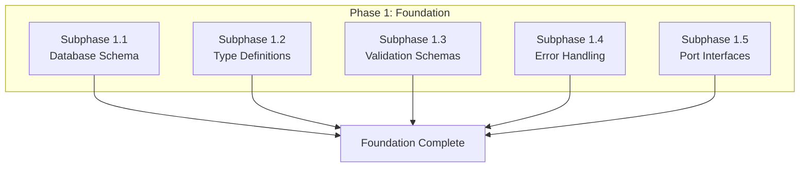

# Phase 1: Foundation & Core Infrastructure

## Document Information

- **Project**: Weople - Professional Relationship Management Platform
- **Phase**: 1 - Foundation & Core Infrastructure
- **Version**: 1.0.0
- **Last Updated**: 2026-01-29
- **Status**: Draft
- **Prerequisite**: None - This is the foundational phase

---

## Phase Overview

This phase establishes the foundational infrastructure required for all subsequent phases. It includes database schema, type definitions, validation schemas, error handling patterns, and core service abstractions. All subphases in this phase are **MECE** (Mutually Exclusive, Collectively Exhaustive) and can be executed **in parallel** by sub-agents.



---

## Subphase 1.1: Database Schema & Migrations

### Objective

Create the complete PostgreSQL database schema with RLS policies, indexes, and migrations as specified in SDS Section 3 and ADR-005.

### TDD Approach

#### RED: Write Failing Tests

1. Create migration test file that verifies all tables exist
2. Create RLS policy test file that verifies security
3. Create index test file that verifies query performance

#### GREEN: Implement Schema

**Files to Create:**

| File Path                                               | Description                        |
| ------------------------------------------------------- | ---------------------------------- |
| `supabase/migrations/00000000000000_initial_schema.sql` | Base schema with extensions        |
| `supabase/migrations/00000000000001_profiles.sql`       | User profiles table                |
| `supabase/migrations/00000000000002_contacts.sql`       | Contacts table with vector support |
| `supabase/migrations/00000000000003_interactions.sql`   | Interactions table                 |
| `supabase/migrations/00000000000004_follow_ups.sql`     | Follow-ups table                   |
| `supabase/migrations/00000000000005_tags.sql`           | Tags and contact_tags junction     |
| `supabase/migrations/00000000000006_opportunities.sql`  | Opportunities tables               |
| `supabase/migrations/00000000000007_indexes.sql`        | Performance indexes                |
| `supabase/migrations/00000000000008_rls_policies.sql`   | Row Level Security policies        |

**Schema Details (from SDS Section 3.2):**

```sql
-- profiles table
CREATE TABLE profiles (
    id UUID PRIMARY KEY REFERENCES auth.users(id) ON DELETE CASCADE,
    email TEXT UNIQUE NOT NULL,
    full_name TEXT,
    avatar_url TEXT,
    role TEXT DEFAULT 'user' CHECK (role IN ('user', 'admin')),
    preferences JSONB DEFAULT '{}',
    ai_enabled BOOLEAN DEFAULT TRUE,
    created_at TIMESTAMPTZ DEFAULT NOW()
);

-- contacts table (with vector reference)
CREATE TABLE contacts (
    id UUID PRIMARY KEY DEFAULT gen_random_uuid(),
    user_id UUID NOT NULL REFERENCES auth.users(id) ON DELETE CASCADE,
    name TEXT NOT NULL,
    email TEXT,
    phone TEXT,
    company TEXT,
    job_title TEXT,
    bio TEXT,
    metadata JSONB DEFAULT '{}',
    vector_id TEXT, -- Reference to Qdrant
    health_score INTEGER DEFAULT 50 CHECK (health_score BETWEEN 0 AND 100),
    last_interaction TIMESTAMPTZ,
    deleted_at TIMESTAMPTZ,
    created_at TIMESTAMPTZ DEFAULT NOW(),
    updated_at TIMESTAMPTZ DEFAULT NOW(),
    UNIQUE(user_id, email)
);

-- interaction_types (system + user-defined)
CREATE TABLE interaction_types (
    id UUID PRIMARY KEY DEFAULT gen_random_uuid(),
    user_id UUID REFERENCES auth.users(id) ON DELETE CASCADE,
    name TEXT NOT NULL,
    icon TEXT DEFAULT 'message-circle',
    color TEXT DEFAULT '#3b82f6',
    is_system BOOLEAN DEFAULT FALSE,
    created_at TIMESTAMPTZ DEFAULT NOW(),
    UNIQUE(user_id, name)
);

-- interactions table
CREATE TABLE interactions (
    id UUID PRIMARY KEY DEFAULT gen_random_uuid(),
    contact_id UUID NOT NULL REFERENCES contacts(id) ON DELETE CASCADE,
    user_id UUID NOT NULL REFERENCES auth.users(id) ON DELETE CASCADE,
    type_id UUID NOT NULL REFERENCES interaction_types(id),
    interaction_date TIMESTAMPTZ NOT NULL DEFAULT NOW(),
    notes TEXT,
    sentiment_score FLOAT CHECK (sentiment_score BETWEEN -1 AND 1),
    metadata JSONB DEFAULT '{}',
    created_at TIMESTAMPTZ DEFAULT NOW()
);

-- follow_ups table
CREATE TABLE follow_ups (
    id UUID PRIMARY KEY DEFAULT gen_random_uuid(),
    contact_id UUID REFERENCES contacts(id) ON DELETE SET NULL,
    user_id UUID NOT NULL REFERENCES auth.users(id) ON DELETE CASCADE,
    title TEXT NOT NULL,
    description TEXT,
    due_date TIMESTAMPTZ NOT NULL,
    priority TEXT DEFAULT 'medium' CHECK (priority IN ('low', 'medium', 'high', 'critical')),
    completed BOOLEAN DEFAULT FALSE,
    completed_at TIMESTAMPTZ,
    ai_suggested BOOLEAN DEFAULT FALSE,
    created_at TIMESTAMPTZ DEFAULT NOW()
);

-- tags table
CREATE TABLE tags (
    id UUID PRIMARY KEY DEFAULT gen_random_uuid(),
    user_id UUID NOT NULL REFERENCES auth.users(id) ON DELETE CASCADE,
    name TEXT NOT NULL,
    color TEXT DEFAULT '#3b82f6',
    parent_id UUID REFERENCES tags(id) ON DELETE SET NULL,
    description TEXT,
    created_at TIMESTAMPTZ DEFAULT NOW(),
    UNIQUE(user_id, name)
);

-- contact_tags junction
CREATE TABLE contact_tags (
    contact_id UUID NOT NULL REFERENCES contacts(id) ON DELETE CASCADE,
    tag_id UUID NOT NULL REFERENCES tags(id) ON DELETE CASCADE,
    created_at TIMESTAMPTZ DEFAULT NOW(),
    PRIMARY KEY (contact_id, tag_id)
);

-- opportunities table
CREATE TABLE opportunities (
    id UUID PRIMARY KEY DEFAULT gen_random_uuid(),
    user_id UUID NOT NULL REFERENCES auth.users(id) ON DELETE CASCADE,
    title TEXT NOT NULL,
    description TEXT,
    value DECIMAL(15,2),
    currency TEXT DEFAULT 'USD',
    stage TEXT DEFAULT 'prospecting' CHECK (stage IN ('prospecting', 'qualification', 'proposal', 'negotiation', 'closed_won', 'closed_lost')),
    probability INTEGER CHECK (probability BETWEEN 0 AND 100),
    expected_close TIMESTAMPTZ,
    actual_close TIMESTAMPTZ,
    outcome TEXT,
    ai_detected BOOLEAN DEFAULT FALSE,
    created_at TIMESTAMPTZ DEFAULT NOW(),
    updated_at TIMESTAMPTZ DEFAULT NOW()
);

-- opportunity_contacts junction
CREATE TABLE opportunity_contacts (
    opportunity_id UUID NOT NULL REFERENCES opportunities(id) ON DELETE CASCADE,
    contact_id UUID NOT NULL REFERENCES contacts(id) ON DELETE CASCADE,
    role TEXT DEFAULT 'influencer' CHECK (role IN ('decision_maker', 'influencer', 'user', 'champion', 'blocker')),
    created_at TIMESTAMPTZ DEFAULT NOW(),
    PRIMARY KEY (opportunity_id, contact_id)
);
```

#### BLUE: Refactor

- Optimize index definitions
- Add composite indexes for common queries
- Normalize where beneficial

#### REG: Regression Testing

- Run all migration tests
- Verify rollback capability
- Test RLS policies with actual queries

### Acceptance Criteria

- [ ] All 8 core tables created with proper constraints
- [ ] RLS policies enabled on all user-data tables
- [ ] Indexes created for performance
- [ ] Migrations are reversible
- [ ] System interaction types seeded

---

## Subphase 1.2: Type Definitions

### Objective

Create comprehensive TypeScript type definitions for all entities, API requests/responses, and domain models as specified in SDS Section 3.

### TDD Approach

#### RED: Write Failing Tests

1. Create type compatibility tests
2. Create interface completeness tests

#### GREEN: Implement Types

**Files to Create:**

| File Path                                                 | Description              |
| --------------------------------------------------------- | ------------------------ |
| `libs/shared/types/src/lib/entities/profile.types.ts`     | Profile entity types     |
| `libs/shared/types/src/lib/entities/contact.types.ts`     | Contact entity types     |
| `libs/shared/types/src/lib/entities/interaction.types.ts` | Interaction entity types |
| `libs/shared/types/src/lib/entities/followup.types.ts`    | Follow-up entity types   |
| `libs/shared/types/src/lib/entities/tag.types.ts`         | Tag entity types         |
| `libs/shared/types/src/lib/entities/opportunity.types.ts` | Opportunity entity types |
| `libs/shared/types/src/lib/api/request.types.ts`          | API request types        |
| `libs/shared/types/src/lib/api/response.types.ts`         | API response types       |
| `libs/shared/types/src/lib/domain/health.types.ts`        | Health scoring types     |
| `libs/shared/types/src/lib/domain/ai.types.ts`            | AI-related types         |

**Type Definitions (from SDS):**

```typescript
// libs/shared/types/src/lib/entities/contact.types.ts
export interface Contact {
  id: string;
  user_id: string;
  name: string;
  email?: string;
  phone?: string;
  company?: string;
  job_title?: string;
  bio?: string;
  metadata: Record<string, unknown>;
  vector_id?: string;
  health_score: number;
  last_interaction?: string;
  deleted_at?: string;
  created_at: string;
  updated_at: string;
  tags?: Tag[];
}

export interface CreateContactInput {
  name: string;
  email?: string;
  phone?: string;
  company?: string;
  job_title?: string;
  bio?: string;
  tags?: string[];
}

export interface UpdateContactInput {
  name?: string;
  email?: string;
  phone?: string;
  company?: string;
  job_title?: string;
  bio?: string;
}

// libs/shared/types/src/lib/entities/interaction.types.ts
export interface Interaction {
  id: string;
  contact_id: string;
  user_id: string;
  type_id: string;
  interaction_date: string;
  notes?: string;
  sentiment_score?: number;
  metadata: Record<string, unknown>;
  created_at: string;
  type?: InteractionType;
}

export interface InteractionType {
  id: string;
  user_id?: string;
  name: string;
  icon: string;
  color: string;
  is_system: boolean;
  created_at: string;
}

export interface CreateInteractionInput {
  contact_id: string;
  type_id: string;
  interaction_date: string;
  notes?: string;
  metadata?: Record<string, unknown>;
}

// libs/shared/types/src/lib/entities/followup.types.ts
export interface FollowUp {
  id: string;
  contact_id?: string;
  user_id: string;
  title: string;
  description?: string;
  due_date: string;
  priority: 'low' | 'medium' | 'high' | 'critical';
  completed: boolean;
  completed_at?: string;
  ai_suggested: boolean;
  created_at: string;
  contact?: Contact;
}

// libs/shared/types/src/lib/entities/tag.types.ts
export interface Tag {
  id: string;
  user_id: string;
  name: string;
  color: string;
  parent_id?: string;
  description?: string;
  created_at: string;
  contact_count?: number;
}

// libs/shared/types/src/lib/entities/opportunity.types.ts
export interface Opportunity {
  id: string;
  user_id: string;
  title: string;
  description?: string;
  value?: number;
  currency: string;
  stage: OpportunityStage;
  probability?: number;
  expected_close?: string;
  actual_close?: string;
  outcome?: string;
  ai_detected: boolean;
  created_at: string;
  updated_at: string;
  contacts?: OpportunityContact[];
}

export type OpportunityStage =
  | 'prospecting'
  | 'qualification'
  | 'proposal'
  | 'negotiation'
  | 'closed_won'
  | 'closed_lost';

export interface OpportunityContact {
  opportunity_id: string;
  contact_id: string;
  role: 'decision_maker' | 'influencer' | 'user' | 'champion' | 'blocker';
  contact?: Contact;
}

// libs/shared/types/src/lib/domain/health.types.ts
export interface HealthMetrics {
  score: number;
  trend: 'improving' | 'stable' | 'declining';
  factors: HealthFactor[];
}

export interface HealthFactor {
  name: string;
  weight: number;
  contribution: number;
}

// libs/shared/types/src/lib/domain/ai.types.ts
export interface AIEnrichmentResult {
  job_title?: { value: string; confidence: number };
  company?: { value: string; confidence: number };
  industry?: { value: string; confidence: number };
  bio?: { value: string; confidence: number };
}

export interface SentimentResult {
  score: number;
  label:
    | 'very_negative'
    | 'negative'
    | 'neutral'
    | 'positive'
    | 'very_positive';
  topics: string[];
  action_items: string[];
}
```

#### BLUE: Refactor

- Extract common patterns
- Use strict type utilities
- Add branded types where needed

#### REG: Regression Testing

- Verify type compatibility with schema
- Test type inference

### Acceptance Criteria

- [ ] All entity types defined
- [ ] API request/response types defined
- [ ] Domain-specific types defined
- [ ] Types are strict (no `any`)
- [ ] Index exports updated

---

## Subphase 1.3: Validation Schemas

### Objective

Create Zod validation schemas for all inputs, ensuring runtime type safety and detailed error messages.

### TDD Approach

#### RED: Write Failing Tests

1. Create validation test file with edge cases
2. Create error message tests

#### GREEN: Implement Schemas

**Files to Create:**

| File Path                                                          | Description            |
| ------------------------------------------------------------------ | ---------------------- |
| `libs/shared/data-access/src/lib/validation/common.schema.ts`      | Common validators      |
| `libs/shared/data-access/src/lib/validation/contact.schema.ts`     | Contact validation     |
| `libs/shared/data-access/src/lib/validation/interaction.schema.ts` | Interaction validation |
| `libs/shared/data-access/src/lib/validation/followup.schema.ts`    | Follow-up validation   |
| `libs/shared/data-access/src/lib/validation/tag.schema.ts`         | Tag validation         |
| `libs/shared/data-access/src/lib/validation/opportunity.schema.ts` | Opportunity validation |
| `libs/shared/data-access/src/lib/validation/auth.schema.ts`        | Auth validation        |

**Schema Definitions:**

```typescript
// libs/shared/data-access/src/lib/validation/common.schema.ts
import { z } from 'zod';

export const uuidSchema = z.string().uuid();

export const emailSchema = z.string().email('Invalid email format');

export const phoneSchema = z
  .string()
  .regex(/^\+?[1-9]\d{1,14}$/, 'Invalid phone number format (E.164)');

export const paginationSchema = z.object({
  page: z.number().int().min(1).default(1),
  limit: z.number().int().min(1).max(100).default(20),
});

// libs/shared/data-access/src/lib/validation/contact.schema.ts
export const createContactSchema = z.object({
  name: z.string().min(1, 'Name is required').max(255),
  email: z.string().email().optional(),
  phone: phoneSchema.optional(),
  company: z.string().max(255).optional(),
  job_title: z.string().max(255).optional(),
  bio: z.string().max(2000).optional(),
  tags: z.array(uuidSchema).optional(),
});

export const updateContactSchema = createContactSchema.partial();

// libs/shared/data-access/src/lib/validation/interaction.schema.ts
export const createInteractionSchema = z.object({
  contact_id: uuidSchema,
  type_id: uuidSchema,
  interaction_date: z.string().datetime(),
  notes: z.string().max(10000).optional(),
  metadata: z.record(z.unknown()).optional(),
});

// libs/shared/data-access/src/lib/validation/followup.schema.ts
export const createFollowUpSchema = z.object({
  contact_id: uuidSchema.optional(),
  title: z.string().min(1).max(255),
  description: z.string().max(2000).optional(),
  due_date: z.string().datetime(),
  priority: z.enum(['low', 'medium', 'high', 'critical']),
});

// libs/shared/data-access/src/lib/validation/tag.schema.ts
export const createTagSchema = z.object({
  name: z.string().min(1).max(50),
  color: z
    .string()
    .regex(/^#[0-9A-Fa-f]{6}$/, 'Must be hex color')
    .default('#3b82f6'),
  parent_id: uuidSchema.optional(),
  description: z.string().max(500).optional(),
});

// libs/shared/data-access/src/lib/validation/opportunity.schema.ts
export const createOpportunitySchema = z.object({
  title: z.string().min(1).max(255),
  description: z.string().max(5000).optional(),
  value: z.number().positive().optional(),
  currency: z.string().length(3).default('USD'),
  stage: z.enum([
    'prospecting',
    'qualification',
    'proposal',
    'negotiation',
    'closed_won',
    'closed_lost',
  ]),
  probability: z.number().int().min(0).max(100).optional(),
  expected_close: z.string().datetime().optional(),
  contact_ids: z.array(uuidSchema).optional(),
});
```

#### BLUE: Refactor

- Extract common validation patterns
- Create reusable validators
- Add custom error messages

#### REG: Regression Testing

- Test all validation edge cases
- Verify error message quality

### Acceptance Criteria

- [ ] All input schemas defined
- [ ] Schemas match database constraints
- [ ] Custom error messages implemented
- [ ] Type inference works correctly

---

## Subphase 1.4: Error Handling Patterns

### Objective

Establish standardized error handling patterns including custom error types, error codes, and Result pattern implementation.

### TDD Approach

#### RED: Write Failing Tests

1. Create error type tests
2. Create Result pattern tests
3. Create error handling flow tests

#### GREEN: Implement Error Handling

**Files to Create:**

| File Path                                               | Description                   |
| ------------------------------------------------------- | ----------------------------- |
| `libs/shared/data-access/src/lib/errors/error.types.ts` | Error type definitions        |
| `libs/shared/data-access/src/lib/errors/error.codes.ts` | Error code constants          |
| `libs/shared/data-access/src/lib/errors/result.ts`      | Result pattern implementation |
| `libs/shared/data-access/src/lib/errors/app-error.ts`   | Base application error        |

**Implementation:**

```typescript
// libs/shared/data-access/src/lib/errors/error.codes.ts
export const ErrorCodes = {
  // Auth errors
  AUTH_UNAUTHORIZED: 'AUTH_001',
  AUTH_FORBIDDEN: 'AUTH_002',
  AUTH_INVALID_CREDENTIALS: 'AUTH_003',
  AUTH_SESSION_EXPIRED: 'AUTH_004',

  // Validation errors
  VALIDATION_INVALID_INPUT: 'VAL_001',
  VALIDATION_REQUIRED_FIELD: 'VAL_002',
  VALIDATION_INVALID_FORMAT: 'VAL_003',

  // Resource errors
  RESOURCE_NOT_FOUND: 'RES_001',
  RESOURCE_ALREADY_EXISTS: 'RES_002',
  RESOURCE_CONFLICT: 'RES_003',

  // Database errors
  DB_CONNECTION_ERROR: 'DB_001',
  DB_QUERY_ERROR: 'DB_002',
  DB_CONSTRAINT_VIOLATION: 'DB_003',

  // AI errors
  AI_PROCESSING_ERROR: 'AI_001',
  AI_RATE_LIMIT: 'AI_002',
  AI_BUDGET_EXCEEDED: 'AI_003',

  // Network errors
  NETWORK_ERROR: 'NET_001',
  TIMEOUT_ERROR: 'NET_002',

  // Unknown
  UNKNOWN_ERROR: 'UNK_001',
} as const;

// libs/shared/data-access/src/lib/errors/app-error.ts
export class AppError extends Error {
  constructor(
    message: string,
    public readonly code: string,
    public readonly statusCode: number = 500,
    public readonly details?: Record<string, unknown>,
  ) {
    super(message);
    this.name = 'AppError';
    Object.setPrototypeOf(this, AppError.prototype);
  }
}

export class ValidationError extends AppError {
  constructor(
    message: string,
    public readonly fieldErrors?: Record<string, string[]>,
  ) {
    super(message, ErrorCodes.VALIDATION_INVALID_INPUT, 400, { fieldErrors });
    this.name = 'ValidationError';
  }
}

export class NotFoundError extends AppError {
  constructor(resource: string, id?: string) {
    super(
      `${resource}${id ? ` with id ${id}` : ''} not found`,
      ErrorCodes.RESOURCE_NOT_FOUND,
      404,
      { resource, id },
    );
    this.name = 'NotFoundError';
  }
}

export class UnauthorizedError extends AppError {
  constructor(message = 'Unauthorized') {
    super(message, ErrorCodes.AUTH_UNAUTHORIZED, 401);
    this.name = 'UnauthorizedError';
  }
}

// libs/shared/data-access/src/lib/errors/result.ts
export type Result<T, E = AppError> =
  | { success: true; data: T; error: null }
  | { success: false; data: null; error: E };

export function success<T>(data: T): Result<T, never> {
  return { success: true, data, error: null };
}

export function failure<E extends AppError>(error: E): Result<never, E> {
  return { success: false, data: null, error };
}

export async function tryCatch<T>(
  fn: () => Promise<T>,
  errorMapper?: (error: unknown) => AppError,
): Promise<Result<T, AppError>> {
  try {
    const data = await fn();
    return success(data);
  } catch (error) {
    const mappedError = errorMapper
      ? errorMapper(error)
      : new AppError(
          error instanceof Error ? error.message : 'Unknown error',
          ErrorCodes.UNKNOWN_ERROR,
        );
    return failure(mappedError);
  }
}
```

#### BLUE: Refactor

- Create error factory functions
- Add error serialization
- Implement error logging integration

#### REG: Regression Testing

- Test error propagation
- Verify error serialization

### Acceptance Criteria

- [ ] Custom error classes defined
- [ ] Error codes standardized
- [ ] Result pattern implemented
- [ ] tryCatch helper works correctly
- [ ] Error types are serializable

---

## Subphase 1.5: Port Interfaces (Adapter Pattern)

### Objective

Define the Port interfaces for the Adapter pattern as specified in ADR-012 and SDS Section 3.2.6.

### TDD Approach

#### RED: Write Failing Tests

1. Create interface contract tests
2. Create mock adapter implementations for testing

#### GREEN: Implement Ports

**Files to Create:**

| File Path                                                           | Description              |
| ------------------------------------------------------------------- | ------------------------ |
| `libs/shared/data-access/src/lib/ports/relational-database.port.ts` | Relational DB interface  |
| `libs/shared/data-access/src/lib/ports/graph-database.port.ts`      | Graph DB interface       |
| `libs/shared/data-access/src/lib/ports/vector-database.port.ts`     | Vector DB interface      |
| `libs/shared/data-access/src/lib/ports/object-storage.port.ts`      | Object storage interface |
| `libs/shared/data-access/src/lib/ports/ai-gateway.port.ts`          | AI gateway interface     |
| `libs/shared/data-access/src/lib/ports/index.ts`                    | Port exports             |

**Port Definitions (from SDS Section 3.2.6):**

```typescript
// libs/shared/data-access/src/lib/ports/relational-database.port.ts
export interface FilterOptions {
  where?: Record<string, unknown>;
  orderBy?: { column: string; direction: 'asc' | 'desc' };
  limit?: number;
  offset?: number;
}

export interface Transaction {
  // Transaction methods
  commit(): Promise<void>;
  rollback(): Promise<void>;
}

export interface Subscription {
  unsubscribe(): void;
}

export interface RelationalDatabasePort {
  // Connection management
  connect(): Promise<void>;
  disconnect(): Promise<void>;

  // Generic CRUD operations
  findOne<T>(table: string, id: string): Promise<T | null>;
  findMany<T>(table: string, filters: FilterOptions): Promise<T[]>;
  insert<T>(table: string, data: Partial<T>): Promise<T>;
  update<T>(table: string, id: string, data: Partial<T>): Promise<T>;
  delete(table: string, id: string, soft?: boolean): Promise<void>;

  // Transaction support
  transaction<T>(callback: (trx: Transaction) => Promise<T>): Promise<T>;

  // Realtime subscriptions
  subscribe<T>(
    table: string,
    filters: FilterOptions,
    callback: (payload: T) => void,
  ): Subscription;
}

// libs/shared/data-access/src/lib/ports/graph-database.port.ts
export interface PathResult {
  path: string[];
  length: number;
  strength: number;
}

export interface Neighbor {
  id: string;
  name: string;
  relationship: string;
  strength: number;
}

export interface Community {
  id: string;
  members: string[];
  memberCount: number;
}

export interface GraphDatabasePort {
  // Connection management
  connect(): Promise<void>;
  disconnect(): Promise<void>;

  // RDF operations
  addTriple(subject: string, predicate: string, object: string): Promise<void>;
  removeTriple(
    subject: string,
    predicate: string,
    object: string,
  ): Promise<void>;

  // SPARQL queries
  query<T>(sparqlQuery: string): Promise<T[]>;

  // Network graph operations
  findPath(
    startNode: string,
    endNode: string,
    maxDepth: number,
  ): Promise<PathResult | null>;
  getNeighbors(node: string, relationshipTypes?: string[]): Promise<Neighbor[]>;
  calculateCentrality(node: string): Promise<number>;
  findCommunities(userId: string): Promise<Community[]>;

  // Sync with relational data
  syncContact(contact: unknown): Promise<void>;
  syncRelationship(relationship: unknown): Promise<void>;
}

// libs/shared/data-access/src/lib/ports/vector-database.port.ts
export interface SearchResult {
  id: string;
  score: number;
  metadata: Record<string, unknown>;
}

export interface VectorDatabasePort {
  connect(): Promise<void>;
  disconnect(): Promise<void>;

  // Collection management
  createCollection(name: string, dimension: number): Promise<void>;
  deleteCollection(name: string): Promise<void>;

  // Vector operations
  upsert(
    collection: string,
    id: string,
    vector: number[],
    metadata: Record<string, unknown>,
  ): Promise<void>;

  search(
    collection: string,
    vector: number[],
    filters?: FilterOptions,
    limit?: number,
  ): Promise<SearchResult[]>;

  deleteVector(collection: string, id: string): Promise<void>;
}

// libs/shared/data-access/src/lib/ports/object-storage.port.ts
export interface UploadResult {
  key: string;
  url: string;
  etag: string;
}

export interface ObjectMetadata {
  contentType?: string;
  contentLength?: number;
  customMetadata?: Record<string, string>;
}

export interface ObjectInfo {
  key: string;
  size: number;
  lastModified: Date;
  etag: string;
}

export interface ObjectStoragePort {
  connect(): Promise<void>;
  disconnect(): Promise<void>;

  // Bucket operations
  createBucket(name: string): Promise<void>;
  deleteBucket(name: string): Promise<void>;

  // Object operations
  upload(
    bucket: string,
    key: string,
    data: Buffer | ReadableStream,
    metadata?: ObjectMetadata,
  ): Promise<UploadResult>;

  download(bucket: string, key: string): Promise<Buffer>;
  delete(bucket: string, key: string): Promise<void>;

  // Presigned URLs
  getPresignedUploadUrl(
    bucket: string,
    key: string,
    expiresIn: number,
  ): Promise<string>;
  getPresignedDownloadUrl(
    bucket: string,
    key: string,
    expiresIn: number,
  ): Promise<string>;

  // List objects
  list(bucket: string, prefix?: string): Promise<ObjectInfo[]>;
}

// libs/shared/data-access/src/lib/ports/ai-gateway.port.ts
export interface CompletionRequest {
  model: string;
  messages: Array<{ role: string; content: string }>;
  temperature?: number;
  maxTokens?: number;
}

export interface CompletionResponse {
  content: string;
  model: string;
  usage: {
    promptTokens: number;
    completionTokens: number;
    totalTokens: number;
  };
  cost: number;
}

export interface EmbeddingRequest {
  model: string;
  input: string;
}

export interface EmbeddingResponse {
  embedding: number[];
  model: string;
}

export interface AIGatewayPort {
  // Connection
  configure(config: unknown): Promise<void>;

  // Completion
  completion(request: CompletionRequest): Promise<CompletionResponse>;

  // Embeddings
  embedding(request: EmbeddingRequest): Promise<EmbeddingResponse>;

  // Cost tracking
  getBudgetStatus(): Promise<{
    used: number;
    limit: number;
    remaining: number;
  }>;

  // Health check
  healthCheck(): Promise<boolean>;
}
```

#### BLUE: Refactor

- Extract common patterns
- Add generic constraints
- Create factory types

#### REG: Regression Testing

- Test interface contracts
- Verify mock implementations

### Acceptance Criteria

- [ ] All 5 port interfaces defined
- [ ] Interfaces match SDS specifications
- [ ] Type parameters are properly constrained
- [ ] Documentation comments added

---

## Phase Exit Criteria

All subphases must be completed and the following must be true:

1. [ ] Database migrations run successfully
2. [ ] All TypeScript types compile without errors
3. [ ] Validation schemas pass all tests
4. [ ] Error handling patterns work correctly
5. [ ] Port interfaces are properly defined
6. [ ] 100% test coverage on new code
7. [ ] Code review completed
8. [ ] PR merged to main

---

## Post-Phase Report Template

After completing this phase, fill out:

```markdown
## Phase 1 Completion Report

### Summary

- Date Completed: [DATE]
- Total Files Created: [COUNT]
- Total Lines of Code: [COUNT]
- Test Coverage: [PERCENTAGE]

### Subphase Status

| Subphase               | Status   | Notes |
| ---------------------- | -------- | ----- |
| 1.1 Database Schema    | [STATUS] |       |
| 1.2 Type Definitions   | [STATUS] |       |
| 1.3 Validation Schemas | [STATUS] |       |
| 1.4 Error Handling     | [STATUS] |       |
| 1.5 Port Interfaces    | [STATUS] |       |

### Lessons Learned

- [LESSON 1]
- [LESSON 2]

### Recommendations for Future Phases

- [RECOMMENDATION 1]
- [RECOMMENDATION 2]

### PR Link

[Link to merged PR]
```
