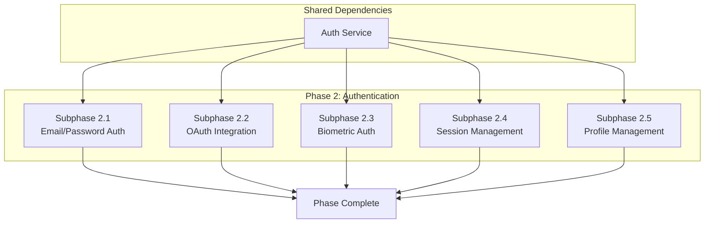

# Phase 2: Authentication & User Management

## Document Information

- **Project**: Weople - Professional Relationship Management Platform
- **Phase**: 2 - Authentication & User Management
- **Version**: 1.0.0
- **Last Updated**: 2026-01-29
- **Status**: Draft
- **Prerequisite**: Phase 1 (Foundation & Core Infrastructure) must be complete

---

## Phase Overview

This phase implements the complete authentication system including email/password auth, OAuth integration, biometric authentication for mobile, session management, and user profile management. All subphases are **MECE** and can be executed **in parallel** after shared dependencies are established.



---

## Shared Dependency: Auth Service

**Must be completed before subphases can run in parallel.**

### Files to Create:

| File Path                                              | Description                 |
| ------------------------------------------------------ | --------------------------- |
| `libs/shared/data-access/src/lib/auth/auth.service.ts` | Core authentication service |
| `libs/shared/data-access/src/lib/auth/auth.types.ts`   | Auth-specific types         |
| `libs/shared/data-access/src/lib/auth/index.ts`        | Auth module exports         |

### Implementation:

```typescript
// libs/shared/data-access/src/lib/auth/auth.types.ts
export interface AuthCredentials {
  email: string;
  password: string;
}

export interface AuthTokens {
  access_token: string;
  refresh_token: string;
  expires_at: number;
}

export interface AuthUser {
  id: string;
  email: string;
  email_confirmed_at?: string;
  phone?: string;
  created_at: string;
  updated_at: string;
  app_metadata: Record<string, unknown>;
  user_metadata: Record<string, unknown>;
}

export interface AuthSession {
  user: AuthUser;
  tokens: AuthTokens;
}

export type AuthProvider = 'google' | 'linkedin';

// libs/shared/data-access/src/lib/auth/auth.service.ts
import { SupabaseClient } from '@supabase/supabase-js';
import { Result, tryCatch } from '../errors/result';
import { AppError, UnauthorizedError } from '../errors/app-error';
import {
  AuthCredentials,
  AuthSession,
  AuthProvider,
  AuthUser,
} from './auth.types';

export class AuthService {
  constructor(private supabase: SupabaseClient) {}

  async signUp(
    credentials: AuthCredentials,
  ): Promise<Result<AuthSession, AppError>> {
    return tryCatch(async () => {
      const { data, error } = await this.supabase.auth.signUp({
        email: credentials.email,
        password: credentials.password,
      });

      if (error) throw new AppError(error.message, 'AUTH_001', 400);
      if (!data.session)
        throw new AppError('Session not created', 'AUTH_002', 500);

      // Create profile record
      await this.createProfile(data.user.id, data.user.email!);

      return {
        user: this.mapUser(data.user),
        tokens: {
          access_token: data.session.access_token,
          refresh_token: data.session.refresh_token,
          expires_at: data.session.expires_at!,
        },
      };
    });
  }

  async signIn(
    credentials: AuthCredentials,
  ): Promise<Result<AuthSession, AppError>> {
    return tryCatch(async () => {
      const { data, error } = await this.supabase.auth.signInWithPassword({
        email: credentials.email,
        password: credentials.password,
      });

      if (error) throw new UnauthorizedError('Invalid credentials');
      if (!data.session)
        throw new AppError('Session not created', 'AUTH_003', 500);

      return {
        user: this.mapUser(data.user),
        tokens: {
          access_token: data.session.access_token,
          refresh_token: data.session.refresh_token,
          expires_at: data.session.expires_at!,
        },
      };
    });
  }

  async signInWithOAuth(
    provider: AuthProvider,
  ): Promise<Result<{ url: string }, AppError>> {
    return tryCatch(async () => {
      const { data, error } = await this.supabase.auth.signInWithOAuth({
        provider,
        options: {
          redirectTo: `${window.location.origin}/auth/callback`,
        },
      });

      if (error) throw new AppError(error.message, 'AUTH_004', 400);
      return { url: data.url };
    });
  }

  async signOut(): Promise<Result<void, AppError>> {
    return tryCatch(async () => {
      const { error } = await this.supabase.auth.signOut();
      if (error) throw new AppError(error.message, 'AUTH_005', 500);
    });
  }

  async refreshSession(
    refreshToken: string,
  ): Promise<Result<AuthSession, AppError>> {
    return tryCatch(async () => {
      const { data, error } = await this.supabase.auth.refreshSession({
        refresh_token: refreshToken,
      });

      if (error) throw new UnauthorizedError('Session expired');
      if (!data.session)
        throw new AppError('Session not refreshed', 'AUTH_006', 500);

      return {
        user: this.mapUser(data.user!),
        tokens: {
          access_token: data.session.access_token,
          refresh_token: data.session.refresh_token,
          expires_at: data.session.expires_at!,
        },
      };
    });
  }

  async getCurrentUser(): Promise<Result<AuthUser | null, AppError>> {
    return tryCatch(async () => {
      const { data, error } = await this.supabase.auth.getUser();
      if (error) return null;
      return data.user ? this.mapUser(data.user) : null;
    });
  }

  async resetPassword(email: string): Promise<Result<void, AppError>> {
    return tryCatch(async () => {
      const { error } = await this.supabase.auth.resetPasswordForEmail(email, {
        redirectTo: `${window.location.origin}/auth/reset-password`,
      });
      if (error) throw new AppError(error.message, 'AUTH_007', 400);
    });
  }

  async updatePassword(newPassword: string): Promise<Result<void, AppError>> {
    return tryCatch(async () => {
      const { error } = await this.supabase.auth.updateUser({
        password: newPassword,
      });
      if (error) throw new AppError(error.message, 'AUTH_008', 400);
    });
  }

  private async createProfile(userId: string, email: string): Promise<void> {
    const { error } = await this.supabase
      .from('profiles')
      .insert({ id: userId, email });

    if (error) {
      console.error('Failed to create profile:', error);
    }
  }

  private mapUser(user: unknown): AuthUser {
    return {
      id: user.id,
      email: user.email!,
      email_confirmed_at: user.email_confirmed_at,
      phone: user.phone ?? undefined,
      created_at: user.created_at,
      updated_at: user.updated_at,
      app_metadata: user.app_metadata,
      user_metadata: user.user_metadata,
    };
  }

  // Realtime auth state subscription
  onAuthStateChange(
    callback: (event: string, session: AuthSession | null) => void,
  ): () => void {
    const { data } = this.supabase.auth.onAuthStateChange((event, session) => {
      if (session) {
        callback(event, {
          user: this.mapUser(session.user),
          tokens: {
            access_token: session.access_token,
            refresh_token: session.refresh_token,
            expires_at: session.expires_at!,
          },
        });
      } else {
        callback(event, null);
      }
    });

    return data.subscription.unsubscribe;
  }
}
```

---

## Subphase 2.1: Email/Password Authentication

### Objective

Implement complete email/password authentication with validation, password strength checking, and error handling.

### TDD Approach

#### RED: Write Failing Tests

1. Create auth service unit tests
2. Create validation tests
3. Create component integration tests

#### GREEN: Implement Features

**Files to Create:**

| File Path                                                | Description                  |
| -------------------------------------------------------- | ---------------------------- |
| `apps/web/src/routes/(auth)/login/+page.svelte`          | Login page                   |
| `apps/web/src/routes/(auth)/register/+page.svelte`       | Registration page            |
| `apps/web/src/routes/(auth)/reset-password/+page.svelte` | Password reset               |
| `apps/web/src/lib/components/auth/LoginForm.svelte`      | Login form component         |
| `apps/web/src/lib/components/auth/RegisterForm.svelte`   | Registration form            |
| `apps/web/src/lib/components/auth/PasswordInput.svelte`  | Password input with strength |
| `apps/web/src/lib/stores/auth.store.ts`                  | Auth state store             |

**Implementation Details:**

```typescript
// apps/web/src/lib/stores/auth.store.ts
import { writable, derived } from 'svelte/store';
import { browser } from '$app/environment';
import { AuthService } from '@weople/shared/data-access';
import { getSupabaseClient } from '@weople/shared/data-access';
import type { AuthSession, AuthUser } from '@weople/types';

interface AuthState {
  user: AuthUser | null;
  session: AuthSession | null;
  loading: boolean;
  error: string | null;
}

function createAuthStore() {
  const { subscribe, set, update } = writable<AuthState>({
    user: null,
    session: null,
    loading: true,
    error: null,
  });

  const authService = new AuthService(getSupabaseClient());

  // Initialize from storage
  if (browser) {
    authService.getCurrentUser().then((result) => {
      if (result.success && result.data) {
        update((state) => ({ ...state, user: result.data, loading: false }));
      } else {
        update((state) => ({ ...state, loading: false }));
      }
    });
  }

  // Subscribe to auth changes
  authService.onAuthStateChange((event, session) => {
    if (session) {
      update((state) => ({
        ...state,
        user: session.user,
        session,
        loading: false,
        error: null,
      }));
    } else {
      update((state) => ({
        ...state,
        user: null,
        session: null,
        loading: false,
      }));
    }
  });

  return {
    subscribe,
    login: async (email: string, password: string) => {
      update((state) => ({ ...state, loading: true, error: null }));
      const result = await authService.signIn({ email, password });

      if (!result.success) {
        update((state) => ({
          ...state,
          loading: false,
          error: result.error.message,
        }));
      }
      return result;
    },
    register: async (email: string, password: string) => {
      update((state) => ({ ...state, loading: true, error: null }));
      const result = await authService.signUp({ email, password });

      if (!result.success) {
        update((state) => ({
          ...state,
          loading: false,
          error: result.error.message,
        }));
      }
      return result;
    },
    logout: async () => {
      update((state) => ({ ...state, loading: true }));
      await authService.signOut();
      update((state) => ({ ...state, loading: false }));
    },
    clearError: () => {
      update((state) => ({ ...state, error: null }));
    },
  };
}

export const authStore = createAuthStore();
export const isAuthenticated = derived(authStore, ($auth) => !!$auth.user);
export const currentUser = derived(authStore, ($auth) => $auth.user);
```

```svelte
<!-- apps/web/src/lib/components/auth/PasswordInput.svelte -->
<script lang="ts">
  import { z } from 'zod';

  export let value = '';
  export let id = 'password';
  export let label = 'Password';
  export let required = true;

  let showPassword = false;
  let strength = 0;

  const passwordSchema = z
    .string()
    .min(12, 'At least 12 characters')
    .regex(/[A-Z]/, 'At least one uppercase')
    .regex(/[a-z]/, 'At least one lowercase')
    .regex(/[0-9]/, 'At least one number')
    .regex(/[^A-Za-z0-9]/, 'At least one special character');

  $: {
    let score = 0;
    if (value.length >= 12) score++;
    if (/[A-Z]/.test(value)) score++;
    if (/[a-z]/.test(value)) score++;
    if (/[0-9]/.test(value)) score++;
    if (/[^A-Za-z0-9]/.test(value)) score++;
    strength = score;
  }

  const strengthLabels = [
    'Very Weak',
    'Weak',
    'Fair',
    'Good',
    'Strong',
    'Very Strong',
  ];
  const strengthColors = [
    'bg-red-500',
    'bg-red-400',
    'bg-yellow-400',
    'bg-yellow-300',
    'bg-green-400',
    'bg-green-500',
  ];
</script>

<div class="form-control w-full">
  <label class="label" for={id}>
    <span class="label-text">{label}</span>
  </label>
  <div class="relative">
    <input
      {id}
      type={showPassword ? 'text' : 'password'}
      class="input input-bordered w-full pr-20"
      bind:value
      {required}
    />
    <button
      type="button"
      class="absolute right-2 top-1/2 -translate-y-1/2 btn btn-ghost btn-sm"
      on:click={() => (showPassword = !showPassword)}
    >
      {showPassword ? 'Hide' : 'Show'}
    </button>
  </div>

  <!-- Strength indicator -->
  <div class="mt-2">
    <div class="flex gap-1 h-2">
      {#each Array(5) as _, i}
        <div
          class="flex-1 rounded-full transition-colors duration-300 {i <
          strength
            ? strengthColors[strength]
            : 'bg-gray-200'}"
        />
      {/each}
    </div>
    <p
      class="text-xs mt-1 {strength >= 4 ? 'text-green-600' : 'text-gray-500'}"
    >
      {strengthLabels[strength]}
    </p>
  </div>

  <label class="label">
    <span class="label-text-alt text-gray-500">
      Min 12 chars, uppercase, lowercase, number, special char
    </span>
  </label>
</div>
```

#### BLUE: Refactor

- Extract common form logic
- Optimize re-renders
- Add accessibility improvements

#### REG: Regression Testing

- Run full auth flow tests
- Test edge cases (network errors, etc.)

### Acceptance Criteria

- [ ] Login page functional
- [ ] Registration page functional
- [ ] Password reset flow working
- [ ] Password strength indicator implemented
- [ ] Form validation with clear errors
- [ ] Auth state persists across reloads
- [ ] 80%+ test coverage

---

## Subphase 2.2: OAuth Integration

### Objective

Implement OAuth authentication with Google and LinkedIn providers using PKCE flow.

### TDD Approach

#### RED: Write Failing Tests

1. Create OAuth flow tests
2. Create callback handler tests
3. Create error scenario tests

#### GREEN: Implement Features

**Files to Create:**

| File Path                                                | Description                  |
| -------------------------------------------------------- | ---------------------------- |
| `apps/web/src/routes/(auth)/oauth/[provider]/+server.ts` | OAuth init endpoint          |
| `apps/web/src/routes/auth/callback/+server.ts`           | OAuth callback handler       |
| `apps/web/src/lib/components/auth/OAuthButtons.svelte`   | OAuth button component       |
| `supabase/config.toml`                                   | OAuth provider configuration |

**Implementation Details:**

```svelte
<!-- apps/web/src/lib/components/auth/OAuthButtons.svelte -->
<script lang="ts">
  import { authStore } from '$lib/stores/auth.store';
  import type { AuthProvider } from '@weople/types';

  const providers: {
    id: AuthProvider;
    name: string;
    icon: string;
    color: string;
  }[] = [
    {
      id: 'google',
      name: 'Google',
      icon: 'google',
      color: 'bg-white text-gray-700 border',
    },
    {
      id: 'linkedin',
      name: 'LinkedIn',
      icon: 'linkedin',
      color: 'bg-[#0077b5] text-white',
    },
  ];

  let loading: AuthProvider | null = null;

  async function handleOAuth(provider: AuthProvider) {
    loading = provider;
    const result = await authStore.signInWithOAuth(provider);

    if (result.success && result.data) {
      // Redirect to OAuth provider
      window.location.href = result.data.url;
    } else {
      authStore.setError(result.error?.message || 'OAuth failed');
    }
    loading = null;
  }
</script>

<div class="space-y-3">
  <div class="divider">or continue with</div>

  <div class="flex flex-col gap-2">
    {#each providers as provider}
      <button
        class="btn {provider.color} w-full gap-2"
        on:click={() => handleOAuth(provider.id)}
        disabled={loading === provider.id}
      >
        {#if loading === provider.id}
          <span class="loading loading-spinner loading-sm"></span>
        {:else}
          <svg class="w-5 h-5" viewBox="0 0 24 24">
            <!-- Provider icon SVG -->
          </svg>
        {/if}
        {provider.name}
      </button>
    {/each}
  </div>
</div>
```

```typescript
// apps/web/src/routes/auth/callback/+server.ts
import { redirect, error } from '@sveltejs/kit';
import type { RequestHandler } from './$types';
import { createSupabaseClient } from '@weople/shared/data-access';

export const GET: RequestHandler = async ({ url, cookies }) => {
  const code = url.searchParams.get('code');
  const error_description = url.searchParams.get('error_description');

  if (error_description) {
    throw error(400, error_description);
  }

  if (!code) {
    throw error(400, 'Missing authorization code');
  }

  const supabase = createSupabaseClient();

  const { data, error: authError } =
    await supabase.auth.exchangeCodeForSession(code);

  if (authError) {
    throw error(400, authError.message);
  }

  if (data.session) {
    // Set session cookie
    cookies.set('session', data.session.access_token, {
      path: '/',
      httpOnly: true,
      sameSite: 'strict',
      secure: process.env.NODE_ENV === 'production',
      maxAge: 60 * 60 * 24 * 7, // 1 week
    });
  }

  // Redirect to dashboard
  throw redirect(303, '/dashboard');
};
```

#### BLUE: Refactor

- Extract OAuth configuration
- Add provider-specific error handling
- Optimize token exchange

#### REG: Regression Testing

- Test each OAuth provider
- Test error scenarios

### Acceptance Criteria

- [ ] Google OAuth working
- [ ] LinkedIn OAuth working
- [ ] PKCE flow implemented
- [ ] Profile data pre-filled from OAuth
- [ ] Error handling for denied permissions
- [ ] Session created after OAuth

---

## Subphase 2.3: Biometric Authentication (Mobile)

### Objective

Implement Face ID/Touch ID biometric authentication for mobile using Expo LocalAuthentication.

### TDD Approach

#### RED: Write Failing Tests

1. Create biometric availability tests
2. Create authentication flow tests
3. Create fallback mechanism tests

#### GREEN: Implement Features

**Files to Create:**

| File Path                                                 | Description                |
| --------------------------------------------------------- | -------------------------- |
| `libs/shared/data-access/src/lib/auth/biometric.ts`       | Biometric service          |
| `libs/shared/data-access/src/lib/auth/biometric.types.ts` | Biometric types            |
| `apps/mobile/src/features/auth/BiometricPrompt.tsx`       | Biometric prompt component |
| `apps/mobile/src/services/secure-storage.ts`              | Secure keychain storage    |

**Implementation Details:**

```typescript
// libs/shared/data-access/src/lib/auth/biometric.ts
import * as LocalAuthentication from 'expo-local-authentication';
import { Platform } from 'react-native';
import { Result, success, failure } from '../errors/result';
import { AppError } from '../errors/app-error';

export interface BiometricCapabilities {
  available: boolean;
  enrolled: boolean;
  types: LocalAuthentication.AuthenticationType[];
}

export interface BiometricAuthResult {
  success: boolean;
  warning?: string;
}

export class BiometricService {
  async checkCapabilities(): Promise<Result<BiometricCapabilities, AppError>> {
    try {
      const available = await LocalAuthentication.hasHardwareAsync();
      const enrolled = await LocalAuthentication.isEnrolledAsync();
      const types =
        await LocalAuthentication.supportedAuthenticationTypesAsync();

      return success({ available, enrolled, types });
    } catch (error) {
      return failure(
        new AppError('Failed to check biometric capabilities', 'BIO_001'),
      );
    }
  }

  async authenticate(
    promptMessage = 'Authenticate to access your contacts',
    fallbackLabel = 'Use password',
  ): Promise<Result<BiometricAuthResult, AppError>> {
    try {
      const result = await LocalAuthentication.authenticateAsync({
        promptMessage,
        fallbackLabel,
        cancelLabel: 'Cancel',
        disableDeviceFallback: false,
      });

      return success({
        success: result.success,
        warning: result.warning,
      });
    } catch (error) {
      return failure(
        new AppError('Biometric authentication failed', 'BIO_002'),
      );
    }
  }

  async isBiometricEnabled(): Promise<boolean> {
    // Check if user has enabled biometric in settings
    // This would check secure storage for a flag
    return false; // Placeholder
  }

  async enableBiometric(): Promise<Result<void, AppError>> {
    // First authenticate to confirm identity
    const authResult = await this.authenticate(
      'Confirm your identity to enable biometric login',
    );

    if (!authResult.success || !authResult.data?.success) {
      return failure(
        new AppError('Authentication required to enable biometric', 'BIO_003'),
      );
    }

    // Store flag in secure storage
    // Implementation depends on secure storage service
    return success(undefined);
  }

  getBiometricTypeLabel(
    types: LocalAuthentication.AuthenticationType[],
  ): string {
    if (
      types.includes(LocalAuthentication.AuthenticationType.FACIAL_RECOGNITION)
    ) {
      return Platform.OS === 'ios' ? 'Face ID' : 'Face Recognition';
    }
    if (types.includes(LocalAuthentication.AuthenticationType.FINGERPRINT)) {
      return Platform.OS === 'ios' ? 'Touch ID' : 'Fingerprint';
    }
    if (types.includes(LocalAuthentication.AuthenticationType.IRIS)) {
      return 'Iris Recognition';
    }
    return 'Biometric';
  }
}
```

```tsx
// apps/mobile/src/features/auth/BiometricPrompt.tsx
import React, { useEffect, useState } from 'react';
import { View, Text, TouchableOpacity, ActivityIndicator } from 'react-native';
import { BiometricService } from '@weople/shared/data-access';
import { Ionicons } from '@expo/vector-icons';

interface BiometricPromptProps {
  onSuccess: () => void;
  onFallback: () => void;
  onCancel: () => void;
}

export const BiometricPrompt: React.FC<BiometricPromptProps> = ({
  onSuccess,
  onFallback,
  onCancel,
}) => {
  const [loading, setLoading] = useState(true);
  const [biometricType, setBiometricType] = useState<string>('Biometric');
  const [error, setError] = useState<string | null>(null);

  const biometricService = new BiometricService();

  useEffect(() => {
    checkBiometricAvailability();
  }, []);

  const checkBiometricAvailability = async () => {
    const result = await biometricService.checkCapabilities();

    if (result.success && result.data.available && result.data.enrolled) {
      setBiometricType(
        biometricService.getBiometricTypeLabel(result.data.types),
      );
      setLoading(false);
      // Auto-prompt after a short delay
      setTimeout(() => handleAuthenticate(), 500);
    } else {
      onFallback();
    }
  };

  const handleAuthenticate = async () => {
    setLoading(true);
    setError(null);

    const result = await biometricService.authenticate();

    if (result.success && result.data?.success) {
      onSuccess();
    } else {
      setError('Authentication failed. Please try again or use password.');
      setLoading(false);
    }
  };

  if (loading) {
    return (
      <View className="flex-1 justify-center items-center p-4">
        <ActivityIndicator size="large" />
        <Text className="mt-4 text-gray-600">
          Checking biometric availability...
        </Text>
      </View>
    );
  }

  return (
    <View className="flex-1 justify-center items-center p-4 bg-white">
      <Ionicons name="finger-print" size={64} color="#3b82f6" />

      <Text className="text-2xl font-bold mt-6 mb-2">
        {biometricType} Login
      </Text>

      <Text className="text-gray-600 text-center mb-8">
        Use {biometricType} to quickly and securely access your account
      </Text>

      {error && <Text className="text-red-500 mb-4 text-center">{error}</Text>}

      <TouchableOpacity
        className="bg-blue-500 px-8 py-4 rounded-full w-full mb-4"
        onPress={handleAuthenticate}
      >
        <Text className="text-white text-center font-semibold text-lg">
          Use {biometricType}
        </Text>
      </TouchableOpacity>

      <TouchableOpacity className="px-8 py-4 w-full" onPress={onFallback}>
        <Text className="text-blue-500 text-center font-semibold">
          Use Password Instead
        </Text>
      </TouchableOpacity>

      <TouchableOpacity className="mt-4" onPress={onCancel}>
        <Text className="text-gray-400">Cancel</Text>
      </TouchableOpacity>
    </View>
  );
};
```

#### BLUE: Refactor

- Extract platform-specific logic
- Optimize secure storage integration
- Add biometric settings management

#### REG: Regression Testing

- Test on iOS (Face ID/Touch ID)
- Test on Android (Fingerprint/Face)
- Test fallback mechanisms

### Acceptance Criteria

- [ ] Biometric availability detection works
- [ ] Face ID authentication works (iOS)
- [ ] Touch ID authentication works (iOS)
- [ ] Fingerprint authentication works (Android)
- [ ] Fallback to password available
- [ ] Secure storage integration complete

---

## Subphase 2.4: Session Management

### Objective

Implement comprehensive session management including token refresh, idle timeout, active session tracking, and session revocation.

### TDD Approach

#### RED: Write Failing Tests

1. Create token refresh tests
2. Create idle timeout tests
3. Create session tracking tests

#### GREEN: Implement Features

**Files to Create:**

| File Path                                                 | Description                |
| --------------------------------------------------------- | -------------------------- |
| `libs/shared/data-access/src/lib/auth/session.service.ts` | Session management service |
| `libs/shared/data-access/src/lib/auth/session.store.ts`   | Session storage adapter    |
| `apps/web/src/lib/components/auth/SessionTimeout.svelte`  | Timeout warning component  |
| `apps/web/src/lib/hooks/useIdleTimeout.ts`                | Idle timeout hook          |

**Implementation Details:**

```typescript
// libs/shared/data-access/src/lib/auth/session.service.ts
import { SupabaseClient } from '@supabase/supabase-js';
import { Result, tryCatch } from '../errors/result';
import { AppError } from '../errors/app-error';
import type { AuthSession, AuthTokens } from './auth.types';

export interface SessionInfo {
  id: string;
  device: string;
  location?: string;
  created_at: string;
  last_active_at: string;
}

export interface IdleTimeoutConfig {
  timeoutMinutes: number;
  warningMinutes: number;
}

export class SessionService {
  private refreshTimer: ReturnType<typeof setInterval> | null = null;
  private idleTimer: ReturnType<typeof setTimeout> | null = null;
  private warningTimer: ReturnType<typeof setTimeout> | null = null;

  constructor(
    private supabase: SupabaseClient,
    private config: IdleTimeoutConfig = {
      timeoutMinutes: 30,
      warningMinutes: 5,
    },
  ) {}

  startTokenRefresh(onRefresh: (session: AuthSession) => void): void {
    // Refresh token 5 minutes before expiry
    this.refreshTimer = setInterval(async () => {
      const { data } = await this.supabase.auth.getSession();
      if (data.session) {
        const expiresAt = data.session.expires_at! * 1000;
        const now = Date.now();
        const fiveMinutes = 5 * 60 * 1000;

        if (expiresAt - now < fiveMinutes) {
          const { data: refreshData, error } =
            await this.supabase.auth.refreshSession();
          if (!error && refreshData.session) {
            onRefresh({
              user: refreshData.session.user as unknown as AuthSession['user'],
              tokens: {
                access_token: refreshData.session.access_token,
                refresh_token: refreshData.session.refresh_token,
                expires_at: refreshData.session.expires_at!,
              },
            });
          }
        }
      }
    }, 60000); // Check every minute
  }

  stopTokenRefresh(): void {
    if (this.refreshTimer) {
      clearInterval(this.refreshTimer);
      this.refreshTimer = null;
    }
  }

  startIdleTimeout(onWarning: () => void, onTimeout: () => void): void {
    this.resetIdleTimeout(onWarning, onTimeout);

    // Track user activity
    const events = ['mousedown', 'keydown', 'touchstart', 'scroll'];
    const handleActivity = () => this.resetIdleTimeout(onWarning, onTimeout);

    events.forEach((event) => {
      document.addEventListener(event, handleActivity);
    });
  }

  private resetIdleTimeout(onWarning: () => void, onTimeout: () => void): void {
    // Clear existing timers
    if (this.idleTimer) clearTimeout(this.idleTimer);
    if (this.warningTimer) clearTimeout(this.warningTimer);

    const warningMs =
      (this.config.timeoutMinutes - this.config.warningMinutes) * 60 * 1000;
    const timeoutMs = this.config.timeoutMinutes * 60 * 1000;

    // Set warning timer
    this.warningTimer = setTimeout(onWarning, warningMs);

    // Set timeout timer
    this.idleTimer = setTimeout(onTimeout, timeoutMs);
  }

  stopIdleTimeout(): void {
    if (this.idleTimer) {
      clearTimeout(this.idleTimer);
      this.idleTimer = null;
    }
    if (this.warningTimer) {
      clearTimeout(this.warningTimer);
      this.warningTimer = null;
    }
  }

  async getActiveSessions(): Promise<Result<SessionInfo[], AppError>> {
    return tryCatch(async () => {
      // This would query a sessions table or use Supabase's session API
      // Placeholder implementation
      return [];
    });
  }

  async revokeSession(sessionId: string): Promise<Result<void, AppError>> {
    return tryCatch(async () => {
      // Revoke specific session
      const { error } = await this.supabase.auth.admin.signOut(sessionId);
      if (error) throw new AppError(error.message, 'SESS_001');
    });
  }

  async revokeAllSessions(): Promise<Result<void, AppError>> {
    return tryCatch(async () => {
      const { error } = await this.supabase.auth.signOut({ scope: 'global' });
      if (error) throw new AppError(error.message, 'SESS_002');
    });
  }
}
```

```svelte
<!-- apps/web/src/lib/components/auth/SessionTimeout.svelte -->
<script lang="ts">
  import { onMount, onDestroy } from 'svelte';
  import { authStore } from '$lib/stores/auth.store';
  import { SessionService } from '@weople/shared/data-access';
  import { getSupabaseClient } from '@weople/shared/data-access';
  import { goto } from '$app/navigation';

  let showWarning = false;
  let countdown = 300; // 5 minutes in seconds
  let countdownInterval: ReturnType<typeof setInterval>;

  const sessionService = new SessionService(getSupabaseClient());

  onMount(() => {
    sessionService.startIdleTimeout(
      () => {
        showWarning = true;
        startCountdown();
      },
      () => {
        // Timeout - logout
        handleLogout();
      },
    );
  });

  onDestroy(() => {
    sessionService.stopIdleTimeout();
    if (countdownInterval) clearInterval(countdownInterval);
  });

  function startCountdown() {
    countdownInterval = setInterval(() => {
      countdown--;
      if (countdown <= 0) {
        clearInterval(countdownInterval);
      }
    }, 1000);
  }

  function formatTime(seconds: number): string {
    const mins = Math.floor(seconds / 60);
    const secs = seconds % 60;
    return `${mins}:${secs.toString().padStart(2, '0')}`;
  }

  async function handleStayLoggedIn() {
    showWarning = false;
    countdown = 300;
    clearInterval(countdownInterval);
    sessionService.startIdleTimeout(
      () => {
        showWarning = true;
        startCountdown();
      },
      () => handleLogout(),
    );
  }

  async function handleLogout() {
    await authStore.logout();
    goto('/login');
  }
</script>

{#if showWarning}
  <div class="fixed inset-0 bg-black/50 flex items-center justify-center z-50">
    <div class="bg-white rounded-lg p-6 max-w-md w-full mx-4 shadow-xl">
      <h2 class="text-xl font-bold mb-2">Session Expiring Soon</h2>
      <p class="text-gray-600 mb-4">
        Your session will expire in <span
          class="font-mono font-bold text-red-500">{formatTime(countdown)}</span
        >
        due to inactivity.
      </p>
      <div class="flex gap-3">
        <button class="btn btn-primary flex-1" on:click={handleStayLoggedIn}>
          Stay Logged In
        </button>
        <button class="btn btn-ghost flex-1" on:click={handleLogout}>
          Logout
        </button>
      </div>
    </div>
  </div>
{/if}
```

#### BLUE: Refactor

- Extract configuration
- Optimize timer management
- Add activity debouncing

#### REG: Regression Testing

- Test token refresh flow
- Test idle timeout behavior
- Test session revocation

### Acceptance Criteria

- [ ] Token refresh before expiry
- [ ] Idle timeout after 30 minutes
- [ ] Warning 5 minutes before timeout
- [ ] Active session list viewable
- [ ] Session revocation works
- [ ] All sessions can be revoked

---

## Subphase 2.5: Profile Management

### Objective

Implement user profile management including profile editing, avatar upload, and preferences.

### TDD Approach

#### RED: Write Failing Tests

1. Create profile service tests
2. Create avatar upload tests
3. Create preferences tests

#### GREEN: Implement Features

**Files to Create:**

| File Path                                                     | Description             |
| ------------------------------------------------------------- | ----------------------- |
| `libs/shared/data-access/src/lib/services/profile.service.ts` | Profile service         |
| `apps/web/src/routes/(app)/settings/profile/+page.svelte`     | Profile settings page   |
| `apps/web/src/lib/components/profile/AvatarUpload.svelte`     | Avatar upload component |
| `apps/web/src/lib/components/profile/ProfileForm.svelte`      | Profile form            |

**Implementation Details:**

```typescript
// libs/shared/data-access/src/lib/services/profile.service.ts
import { SupabaseClient } from '@supabase/supabase-js';
import { Result, tryCatch } from '../errors/result';
import { AppError, NotFoundError } from '../errors/app-error';
import type { Profile, UpdateProfileInput } from '@weople/types';

export class ProfileService {
  constructor(private supabase: SupabaseClient) {}

  async getProfile(userId: string): Promise<Result<Profile, AppError>> {
    return tryCatch(async () => {
      const { data, error } = await this.supabase
        .from('profiles')
        .select('*')
        .eq('id', userId)
        .single();

      if (error) {
        if (error.code === 'PGRST116') {
          throw new NotFoundError('Profile', userId);
        }
        throw new AppError(error.message, 'PROF_001');
      }

      return data as Profile;
    });
  }

  async updateProfile(
    userId: string,
    input: UpdateProfileInput,
  ): Promise<Result<Profile, AppError>> {
    return tryCatch(async () => {
      const { data, error } = await this.supabase
        .from('profiles')
        .update({
          full_name: input.full_name,
          preferences: input.preferences,
          updated_at: new Date().toISOString(),
        })
        .eq('id', userId)
        .select()
        .single();

      if (error) throw new AppError(error.message, 'PROF_002');
      return data as Profile;
    });
  }

  async updateEmail(
    userId: string,
    newEmail: string,
  ): Promise<Result<void, AppError>> {
    return tryCatch(async () => {
      const { error } = await this.supabase.auth.updateUser({
        email: newEmail,
      });
      if (error) throw new AppError(error.message, 'PROF_003');
    });
  }

  async uploadAvatar(
    userId: string,
    file: File,
  ): Promise<Result<string, AppError>> {
    return tryCatch(async () => {
      const fileExt = file.name.split('.').pop();
      const fileName = `${userId}/avatar.${fileExt}`;

      const { error: uploadError } = await this.supabase.storage
        .from('avatars')
        .upload(fileName, file, { upsert: true });

      if (uploadError) throw new AppError(uploadError.message, 'PROF_004');

      const { data } = this.supabase.storage
        .from('avatars')
        .getPublicUrl(fileName);
      const avatarUrl = data.publicUrl;

      // Update profile with new avatar URL
      const { error: updateError } = await this.supabase
        .from('profiles')
        .update({ avatar_url: avatarUrl })
        .eq('id', userId);

      if (updateError) throw new AppError(updateError.message, 'PROF_005');

      return avatarUrl;
    });
  }

  async updatePreferences(
    userId: string,
    preferences: Record<string, unknown>,
  ): Promise<Result<Profile, AppError>> {
    return tryCatch(async () => {
      const { data, error } = await this.supabase
        .from('profiles')
        .update({ preferences })
        .eq('id', userId)
        .select()
        .single();

      if (error) throw new AppError(error.message, 'PROF_006');
      return data as Profile;
    });
  }
}
```

```svelte
<!-- apps/web/src/lib/components/profile/AvatarUpload.svelte -->
<script lang="ts">
  import { createEventDispatcher } from 'svelte';
  import { ProfileService } from '@weople/shared/data-access';
  import { getSupabaseClient } from '@weople/shared/data-access';
  import { authStore } from '$lib/stores/auth.store';

  export let currentAvatar: string | null = null;

  let fileInput: HTMLInputElement;
  let uploading = false;
  let error: string | null = null;
  let previewUrl: string | null = null;

  const dispatch = createEventDispatcher<{ success: string }>();
  const profileService = new ProfileService(getSupabaseClient());

  function handleFileSelect(event: Event) {
    const file = (event.target as HTMLInputElement).files?.[0];
    if (!file) return;

    // Validate file type
    if (!file.type.startsWith('image/')) {
      error = 'Please select an image file';
      return;
    }

    // Validate file size (5MB max)
    if (file.size > 5 * 1024 * 1024) {
      error = 'File size must be less than 5MB';
      return;
    }

    // Create preview
    previewUrl = URL.createObjectURL(file);
    error = null;

    // Auto-upload
    handleUpload(file);
  }

  async function handleUpload(file: File) {
    if (!$authStore.user) return;

    uploading = true;
    error = null;

    const result = await profileService.uploadAvatar($authStore.user.id, file);

    if (result.success) {
      dispatch('success', result.data);
      previewUrl = null;
    } else {
      error = result.error.message;
      previewUrl = null;
    }

    uploading = false;
  }

  function triggerFileSelect() {
    fileInput.click();
  }
</script>

<div class="flex flex-col items-center">
  <div class="relative">
    <div class="w-32 h-32 rounded-full overflow-hidden bg-gray-200">
      {#if previewUrl}
        
      {:else if currentAvatar}
        
      {:else}
        <div
          class="w-full h-full flex items-center justify-center text-gray-400"
        >
          <svg class="w-16 h-16" fill="currentColor" viewBox="0 0 20 20">
            <path
              fill-rule="evenodd"
              d="M10 9a3 3 0 100-6 3 3 0 000 6zm-7 9a7 7 0 1114 0H3z"
              clip-rule="evenodd"
            />
          </svg>
        </div>
      {/if}
    </div>

    <button
      class="absolute bottom-0 right-0 btn btn-circle btn-sm btn-primary"
      on:click={triggerFileSelect}
      disabled={uploading}
    >
      {#if uploading}
        <span class="loading loading-spinner loading-xs"></span>
      {:else}
        <svg
          class="w-4 h-4"
          fill="none"
          stroke="currentColor"
          viewBox="0 0 24 24"
        >
          <path
            stroke-linecap="round"
            stroke-linejoin="round"
            stroke-width="2"
            d="M3 9a2 2 0 012-2h.93a2 2 0 001.664-.89l.812-1.22A2 2 0 0110.07 4h3.86a2 2 0 011.664.89l.812 1.22A2 2 0 0018.07 7H19a2 2 0 012 2v9a2 2 0 01-2 2H5a2 2 0 01-2-2V9z"
          />
          <path
            stroke-linecap="round"
            stroke-linejoin="round"
            stroke-width="2"
            d="M15 13a3 3 0 11-6 0 3 3 0 016 0z"
          />
        </svg>
      {/if}
    </button>
  </div>

  {#if error}
    <p class="text-red-500 text-sm mt-2">{error}</p>
  {/if}

  <input
    bind:this={fileInput}
    type="file"
    accept="image/*"
    class="hidden"
    on:change={handleFileSelect}
  />
</div>
```

#### BLUE: Refactor

- Extract image processing
- Add image compression
- Optimize upload flow

#### REG: Regression Testing

- Test profile CRUD operations
- Test avatar upload flow
- Test email change flow

### Acceptance Criteria

- [ ] Profile editing works
- [ ] Avatar upload with crop/resize
- [ ] Email change with verification
- [ ] Preferences saved correctly
- [ ] Form validation implemented

---

## Phase Exit Criteria

All subphases must be completed and the following must be true:

1. [ ] Email/password auth working on web
2. [ ] OAuth integration working (Google, LinkedIn)
3. [ ] Biometric auth working on mobile
4. [ ] Session management implemented
5. [ ] Profile management functional
6. [ ] 80%+ test coverage
7. [ ] Code review completed
8. [ ] PR merged to main

---

## Post-Phase Report Template

After completing this phase, fill out:

```markdown
## Phase 2 Completion Report

### Summary

- Date Completed: [DATE]
- Total Files Created: [COUNT]
- Total Lines of Code: [COUNT]
- Test Coverage: [PERCENTAGE]

### Subphase Status

| Subphase                | Status   | Notes |
| ----------------------- | -------- | ----- |
| 2.1 Email/Password Auth | [STATUS] |       |
| 2.2 OAuth Integration   | [STATUS] |       |
| 2.3 Biometric Auth      | [STATUS] |       |
| 2.4 Session Management  | [STATUS] |       |
| 2.5 Profile Management  | [STATUS] |       |

### Security Review

- [ ] Password requirements enforced
- [ ] PKCE flow implemented
- [ ] RLS policies active
- [ ] Session timeouts working

### Lessons Learned

- [LESSON 1]
- [LESSON 2]

### PR Link

[Link to merged PR]
```
