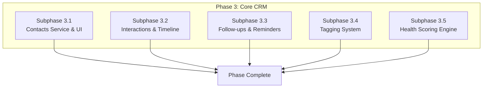

# Phase 3: Core CRM Features - Contacts & Interactions

## Document Information

- **Project**: Weople - Professional Relationship Management Platform
- **Phase**: 3 - Core CRM Features
- **Version**: 1.0.0
- **Last Updated**: 2026-01-29
- **Status**: Draft
- **Prerequisite**: Phase 1 and Phase 2 must be complete

---

## Phase Overview

This phase implements the core CRM functionality including contacts management, interaction logging, follow-up reminders, and tagging. These features form the foundation of the relationship management platform. All subphases are **MECE** and can be executed **in parallel**.



---

## Shared Dependency: Realtime Service

**Must be completed before subphases can run in parallel.**

### Files to Create:

| File Path                                                      | Description                   |
| -------------------------------------------------------------- | ----------------------------- |
| `libs/shared/data-access/src/lib/realtime/realtime.service.ts` | Realtime subscription service |
| `libs/shared/data-access/src/lib/realtime/realtime.types.ts`   | Realtime event types          |
| `libs/shared/data-access/src/lib/realtime/index.ts`            | Realtime exports              |

### Implementation:

```typescript
// libs/shared/data-access/src/lib/realtime/realtime.types.ts
export type RealtimeEventType = 'INSERT' | 'UPDATE' | 'DELETE' | '*';

export interface RealtimeFilter {
  table: string;
  event: RealtimeEventType;
  filter?: string;
}

export interface RealtimePayload<T> {
  eventType: RealtimeEventType;
  new: T | null;
  old: T | null;
}

export type Unsubscribe = () => void;

// libs/shared/data-access/src/lib/realtime/realtime.service.ts
import { SupabaseClient } from '@supabase/supabase-js';
import type {
  RealtimeFilter,
  RealtimePayload,
  Unsubscribe,
} from './realtime.types';

export class RealtimeService {
  private channels: Map<string, ReturnType<SupabaseClient['channel']>> =
    new Map();

  constructor(private supabase: SupabaseClient) {}

  subscribe<T>(
    channelName: string,
    filter: RealtimeFilter,
    callback: (payload: RealtimePayload<T>) => void,
  ): Unsubscribe {
    // Remove existing channel if any
    this.unsubscribe(channelName);

    const channel = this.supabase
      .channel(channelName)
      .on(
        'postgres_changes',
        {
          event: filter.event,
          schema: 'public',
          table: filter.table,
          filter: filter.filter,
        },
        (payload) => {
          callback({
            eventType: payload.eventType as RealtimeEventType,
            new: payload.new as T,
            old: payload.old as T,
          });
        },
      )
      .subscribe();

    this.channels.set(channelName, channel);

    return () => this.unsubscribe(channelName);
  }

  unsubscribe(channelName: string): void {
    const channel = this.channels.get(channelName);
    if (channel) {
      this.supabase.removeChannel(channel);
      this.channels.delete(channelName);
    }
  }

  unsubscribeAll(): void {
    this.channels.forEach((channel) => {
      this.supabase.removeChannel(channel);
    });
    this.channels.clear();
  }
}
```

---

## Subphase 3.1: Contacts Service & UI

### Objective

Implement complete contact management including CRUD operations, search, filtering, and duplicate detection.

### TDD Approach

#### RED: Write Failing Tests

- Contact service tests
- Contact form validation tests
- Search and filter tests
- Duplicate detection tests

#### GREEN: Implement Features

**Files to Create:**

| File Path                                                            | Description                 |
| -------------------------------------------------------------------- | --------------------------- |
| `libs/shared/data-access/src/lib/services/contact.service.ts`        | Contact CRUD service        |
| `libs/shared/data-access/src/lib/services/contact-search.service.ts` | Search & filter service     |
| `libs/shared/data-access/src/lib/services/duplicate.service.ts`      | Duplicate detection service |
| `apps/web/src/routes/(app)/contacts/+page.svelte`                    | Contacts list page          |
| `apps/web/src/routes/(app)/contacts/[id]/+page.svelte`               | Contact detail page         |
| `apps/web/src/lib/components/contacts/ContactForm.svelte`            | Create/edit form            |
| `apps/web/src/lib/components/contacts/ContactCard.svelte`            | Contact card component      |
| `apps/web/src/lib/components/contacts/ContactList.svelte`            | Virtualized list            |
| `apps/web/src/lib/components/contacts/DuplicateWarning.svelte`       | Duplicate alert             |
| `apps/web/src/lib/stores/contacts.store.ts`                          | Contacts state management   |
| `apps/web/feature-contacts/src/lib/index.ts`                         | Feature exports             |

**Key Implementation:**

```typescript
// libs/shared/data-access/src/lib/services/contact.service.ts
import { SupabaseClient } from '@supabase/supabase-js';
import { Result, tryCatch } from '../errors/result';
import { AppError, NotFoundError } from '../errors/app-error';
import type {
  Contact,
  CreateContactInput,
  UpdateContactInput,
} from '@weople/types';

export interface ContactFilters {
  search?: string;
  tags?: string[];
  healthScore?: { min?: number; max?: number };
  company?: string;
  sortBy?: 'name' | 'company' | 'last_interaction' | 'health_score';
  sortOrder?: 'asc' | 'desc';
}

export interface ContactListResult {
  contacts: Contact[];
  total: number;
  page: number;
  limit: number;
}

export class ContactService {
  constructor(private supabase: SupabaseClient) {}

  async getContacts(
    userId: string,
    filters: ContactFilters = {},
    pagination: { page: number; limit: number } = { page: 1, limit: 20 },
  ): Promise<Result<ContactListResult, AppError>> {
    return tryCatch(async () => {
      let query = this.supabase
        .from('contacts')
        .select('*', { count: 'exact' })
        .eq('user_id', userId)
        .is('deleted_at', null);

      // Apply filters
      if (filters.search) {
        query = query.or(
          `name.ilike.%${filters.search}%,email.ilike.%${filters.search}%,company.ilike.%${filters.search}%`,
        );
      }
      if (filters.company) {
        query = query.ilike('company', `%${filters.company}%`);
      }
      if (filters.healthScore) {
        if (filters.healthScore.min !== undefined) {
          query = query.gte('health_score', filters.healthScore.min);
        }
        if (filters.healthScore.max !== undefined) {
          query = query.lte('health_score', filters.healthScore.max);
        }
      }

      // Apply sorting
      const sortColumn = filters.sortBy || 'name';
      const sortOrder = filters.sortOrder || 'asc';
      query = query.order(sortColumn, { ascending: sortOrder === 'asc' });

      // Apply pagination
      const from = (pagination.page - 1) * pagination.limit;
      const to = from + pagination.limit - 1;
      query = query.range(from, to);

      const { data, error, count } = await query;

      if (error) throw new AppError(error.message, 'CONTACT_001');

      // Fetch tags for contacts
      const contactsWithTags = await this.enrichWithTags(data as Contact[]);

      return {
        contacts: contactsWithTags,
        total: count || 0,
        page: pagination.page,
        limit: pagination.limit,
      };
    });
  }

  async getContact(
    userId: string,
    contactId: string,
  ): Promise<Result<Contact, AppError>> {
    return tryCatch(async () => {
      const { data, error } = await this.supabase
        .from('contacts')
        .select('*')
        .eq('id', contactId)
        .eq('user_id', userId)
        .is('deleted_at', null)
        .single();

      if (error) {
        if (error.code === 'PGRST116')
          throw new NotFoundError('Contact', contactId);
        throw new AppError(error.message, 'CONTACT_002');
      }

      const [contactWithTags] = await this.enrichWithTags([data as Contact]);
      return contactWithTags;
    });
  }

  async createContact(
    userId: string,
    input: CreateContactInput,
  ): Promise<Result<Contact, AppError>> {
    return tryCatch(async () => {
      // Check for duplicates
      const duplicateCheck = await this.checkDuplicate(userId, input);
      if (duplicateCheck.success && duplicateCheck.data.isDuplicate) {
        return {
          success: false,
          data: null,
          error: new AppError(
            'Possible duplicate detected',
            'CONTACT_DUPLICATE',
            409,
            { existingContactId: duplicateCheck.data.existingContactId },
          ),
        };
      }

      const { data, error } = await this.supabase
        .from('contacts')
        .insert({
          user_id: userId,
          name: input.name,
          email: input.email,
          phone: input.phone,
          company: input.company,
          job_title: input.job_title,
          bio: input.bio,
          health_score: 50, // Default health score
        })
        .select()
        .single();

      if (error) {
        if (error.code === '23505') {
          throw new AppError(
            'Contact with this email already exists',
            'CONTACT_003',
            409,
          );
        }
        throw new AppError(error.message, 'CONTACT_004');
      }

      // Add tags if provided
      if (input.tags && input.tags.length > 0) {
        await this.addTagsToContact(data.id, input.tags);
      }

      return this.getContact(userId, data.id);
    });
  }

  async updateContact(
    userId: string,
    contactId: string,
    input: UpdateContactInput,
  ): Promise<Result<Contact, AppError>> {
    return tryCatch(async () => {
      const { data, error } = await this.supabase
        .from('contacts')
        .update({
          ...input,
          updated_at: new Date().toISOString(),
        })
        .eq('id', contactId)
        .eq('user_id', userId)
        .select()
        .single();

      if (error) {
        if (error.code === 'PGRST116')
          throw new NotFoundError('Contact', contactId);
        throw new AppError(error.message, 'CONTACT_005');
      }

      return this.getContact(userId, contactId);
    });
  }

  async deleteContact(
    userId: string,
    contactId: string,
  ): Promise<Result<void, AppError>> {
    return tryCatch(async () => {
      // Soft delete
      const { error } = await this.supabase
        .from('contacts')
        .update({ deleted_at: new Date().toISOString() })
        .eq('id', contactId)
        .eq('user_id', userId);

      if (error) throw new AppError(error.message, 'CONTACT_006');
    });
  }

  private async enrichWithTags(contacts: Contact[]): Promise<Contact[]> {
    if (contacts.length === 0) return contacts;

    const contactIds = contacts.map((c) => c.id);
    const { data: tagData, error } = await this.supabase
      .from('contact_tags')
      .select('contact_id, tags(*)')
      .in('contact_id', contactIds);

    if (error || !tagData) return contacts;

    const tagsByContact = tagData.reduce(
      (acc, item) => {
        if (!acc[item.contact_id]) acc[item.contact_id] = [];
        acc[item.contact_id].push(item.tags);
        return acc;
      },
      {} as Record<string, unknown[]>,
    );

    return contacts.map((contact) => ({
      ...contact,
      tags: tagsByContact[contact.id] || [],
    }));
  }

  private async addTagsToContact(
    contactId: string,
    tagIds: string[],
  ): Promise<void> {
    const inserts = tagIds.map((tagId) => ({
      contact_id: contactId,
      tag_id: tagId,
    }));

    await this.supabase.from('contact_tags').insert(inserts);
  }

  private async checkDuplicate(
    userId: string,
    input: CreateContactInput,
  ): Promise<
    Result<{ isDuplicate: boolean; existingContactId?: string }, AppError>
  > {
    if (!input.email)
      return { success: true, data: { isDuplicate: false }, error: null };

    const { data, error } = await this.supabase
      .from('contacts')
      .select('id')
      .eq('user_id', userId)
      .eq('email', input.email)
      .is('deleted_at', null)
      .maybeSingle();

    if (error)
      return { success: true, data: { isDuplicate: false }, error: null };

    return {
      success: true,
      data: {
        isDuplicate: !!data,
        existingContactId: data?.id,
      },
      error: null,
    };
  }
}
```

#### BLUE: Refactor

- Optimize query performance
- Extract common patterns
- Add caching layer

#### REG: Regression Testing

- Test all CRUD operations
- Test search and filter
- Test duplicate detection

### Acceptance Criteria

- [ ] Contact CRUD operations working
- [ ] Search by name/email/company
- [ ] Filter by tags and health score
- [ ] Virtualized list for performance
- [ ] Duplicate detection on create
- [ ] Realtime updates for contact changes

---

## Subphase 3.2: Interactions & Timeline

### Objective

Implement interaction logging with sentiment analysis, timeline display, and relationship health updates.

### TDD Approach

#### RED: Write Failing Tests

- Interaction service tests
- Timeline component tests
- Sentiment analysis tests
- Health score calculation tests

#### GREEN: Implement Features

**Files to Create:**

| File Path                                                             | Description              |
| --------------------------------------------------------------------- | ------------------------ |
| `libs/shared/data-access/src/lib/services/interaction.service.ts`     | Interaction CRUD service |
| `libs/shared/data-access/src/lib/services/health.service.ts`          | Health score calculation |
| `apps/web/src/lib/components/interactions/InteractionForm.svelte`     | Log interaction form     |
| `apps/web/src/lib/components/interactions/InteractionTimeline.svelte` | Timeline component       |
| `apps/web/src/lib/components/interactions/SentimentIndicator.svelte`  | Sentiment display        |
| `apps/web/src/lib/components/interactions/QuickLogButton.svelte`      | FAB for quick logging    |

**Key Implementation:**

```typescript
// libs/shared/data-access/src/lib/services/interaction.service.ts
import { SupabaseClient } from '@supabase/supabase-js';
import { Result, tryCatch } from '../errors/result';
import { AppError, NotFoundError } from '../errors/app-error';
import type { Interaction, CreateInteractionInput } from '@weople/types';

export interface InteractionFilters {
  contactId?: string;
  typeId?: string;
  startDate?: Date;
  endDate?: Date;
  sentiment?: 'positive' | 'negative' | 'neutral';
}

export class InteractionService {
  constructor(private supabase: SupabaseClient) {}

  async getInteractions(
    userId: string,
    filters: InteractionFilters = {},
    pagination: { page: number; limit: number } = { page: 1, limit: 20 },
  ): Promise<Result<{ interactions: Interaction[]; total: number }, AppError>> {
    return tryCatch(async () => {
      let query = this.supabase
        .from('interactions')
        .select('*, type:interaction_types(*)', { count: 'exact' })
        .eq('user_id', userId)
        .order('interaction_date', { ascending: false });

      if (filters.contactId) {
        query = query.eq('contact_id', filters.contactId);
      }
      if (filters.typeId) {
        query = query.eq('type_id', filters.typeId);
      }
      if (filters.startDate) {
        query = query.gte('interaction_date', filters.startDate.toISOString());
      }
      if (filters.endDate) {
        query = query.lte('interaction_date', filters.endDate.toISOString());
      }

      const from = (pagination.page - 1) * pagination.limit;
      const to = from + pagination.limit - 1;
      query = query.range(from, to);

      const { data, error, count } = await query;

      if (error) throw new AppError(error.message, 'INTERACTION_001');

      return {
        interactions: data as Interaction[],
        total: count || 0,
      };
    });
  }

  async createInteraction(
    userId: string,
    input: CreateInteractionInput,
  ): Promise<Result<Interaction, AppError>> {
    return tryCatch(async () => {
      const { data, error } = await this.supabase
        .from('interactions')
        .insert({
          user_id: userId,
          contact_id: input.contact_id,
          type_id: input.type_id,
          interaction_date: input.interaction_date,
          notes: input.notes,
          metadata: input.metadata || {},
        })
        .select('*, type:interaction_types(*)')
        .single();

      if (error) throw new AppError(error.message, 'INTERACTION_002');

      // Update contact's last_interaction
      await this.supabase
        .from('contacts')
        .update({ last_interaction: input.interaction_date })
        .eq('id', input.contact_id);

      return data as Interaction;
    });
  }

  async updateSentiment(
    interactionId: string,
    sentimentScore: number,
  ): Promise<Result<void, AppError>> {
    return tryCatch(async () => {
      const { error } = await this.supabase
        .from('interactions')
        .update({ sentiment_score: sentimentScore })
        .eq('id', interactionId);

      if (error) throw new AppError(error.message, 'INTERACTION_003');
    });
  }
}

// libs/shared/data-access/src/lib/services/health.service.ts
import { SupabaseClient } from '@supabase/supabase-js';
import { Result, tryCatch } from '../errors/result';
import { AppError } from '../errors/app-error';
import type { HealthMetrics, HealthFactor } from '@weople/types';

export class HealthService {
  constructor(private supabase: SupabaseClient) {}

  async calculateHealthScore(
    contactId: string,
  ): Promise<Result<HealthMetrics, AppError>> {
    return tryCatch(async () => {
      // Get interaction history
      const { data: interactions, error } = await this.supabase
        .from('interactions')
        .select('*')
        .eq('contact_id', contactId)
        .order('interaction_date', { ascending: false })
        .limit(50);

      if (error) throw new AppError(error.message, 'HEALTH_001');

      const factors: HealthFactor[] = [];
      let totalScore = 50; // Base score

      // Factor 1: Recency of last interaction
      const lastInteraction = interactions?.[0];
      if (lastInteraction) {
        const daysSinceLastContact = Math.floor(
          (Date.now() - new Date(lastInteraction.interaction_date).getTime()) /
            (1000 * 60 * 60 * 24),
        );

        let recencyScore = 0;
        if (daysSinceLastContact <= 7) recencyScore = 20;
        else if (daysSinceLastContact <= 30) recencyScore = 15;
        else if (daysSinceLastContact <= 90) recencyScore = 10;
        else if (daysSinceLastContact <= 180) recencyScore = 5;
        else recencyScore = -10;

        factors.push({
          name: 'recency',
          weight: 0.3,
          contribution: recencyScore,
        });
        totalScore += recencyScore * 0.3;
      }

      // Factor 2: Interaction frequency
      if (interactions && interactions.length > 0) {
        const threeMonthsAgo = new Date();
        threeMonthsAgo.setMonth(threeMonthsAgo.getMonth() - 3);

        const recentInteractions = interactions.filter(
          (i) => new Date(i.interaction_date) > threeMonthsAgo,
        );

        let frequencyScore = Math.min(recentInteractions.length * 5, 20);
        factors.push({
          name: 'frequency',
          weight: 0.25,
          contribution: frequencyScore,
        });
        totalScore += frequencyScore * 0.25;
      }

      // Factor 3: Sentiment
      const interactionsWithSentiment = interactions?.filter(
        (i) => i.sentiment_score !== null,
      );
      if (interactionsWithSentiment && interactionsWithSentiment.length > 0) {
        const avgSentiment =
          interactionsWithSentiment.reduce(
            (sum, i) => sum + (i.sentiment_score || 0),
            0,
          ) / interactionsWithSentiment.length;

        const sentimentScore = avgSentiment * 20; // Scale -1..1 to -20..20
        factors.push({
          name: 'sentiment',
          weight: 0.2,
          contribution: sentimentScore,
        });
        totalScore += sentimentScore * 0.2;
      }

      // Factor 4: Reciprocity (initiated by contact vs user)
      // This would require tracking initiator - simplified for now
      factors.push({
        name: 'reciprocity',
        weight: 0.25,
        contribution: 5, // Placeholder
      });
      totalScore += 5 * 0.25;

      // Clamp score between 0 and 100
      const finalScore = Math.max(0, Math.min(100, Math.round(totalScore)));

      // Determine trend
      const olderInteractions = interactions?.slice(10);
      let trend: 'improving' | 'stable' | 'declining' = 'stable';
      if (olderInteractions && olderInteractions.length > 0) {
        const recentAvg = this.calculateAvgHealth(interactions?.slice(0, 5));
        const olderAvg = this.calculateAvgHealth(olderInteractions);

        if (recentAvg > olderAvg + 5) trend = 'improving';
        else if (recentAvg < olderAvg - 5) trend = 'declining';
      }

      // Update contact's health score
      await this.supabase
        .from('contacts')
        .update({ health_score: finalScore })
        .eq('id', contactId);

      return {
        score: finalScore,
        trend,
        factors,
      };
    });
  }

  private calculateAvgHealth(interactions: unknown[] | undefined): number {
    if (!interactions || interactions.length === 0) return 50;
    // Simplified - would calculate based on interaction quality
    return 50;
  }
}
```

#### BLUE: Refactor

- Extract health calculation constants
- Optimize timeline rendering
- Add interaction grouping

#### REG: Regression Testing

- Test interaction CRUD
- Test health score calculation
- Test timeline display

### Acceptance Criteria

- [ ] Interaction logging functional
- [ ] Timeline with infinite scroll
- [ ] Sentiment score display
- [ ] Health score calculated and updated
- [ ] Quick log FAB implemented
- [ ] Swipe actions on mobile

---

## Subphase 3.3: Follow-ups & Reminders

### Objective

Implement follow-up reminder system with notifications, scheduling, and dashboard.

### Files to Create:

| File Path                                                       | Description               |
| --------------------------------------------------------------- | ------------------------- |
| `libs/shared/data-access/src/lib/services/followup.service.ts`  | Follow-up CRUD service    |
| `libs/shared/data-access/src/lib/notifications/push.service.ts` | Push notification service |
| `apps/web/src/routes/(app)/follow-ups/+page.svelte`             | Follow-ups dashboard      |
| `apps/web/src/lib/components/followups/FollowUpForm.svelte`     | Create/edit form          |
| `apps/web/src/lib/components/followups/FollowUpList.svelte`     | Grouped list              |
| `apps/web/src/lib/components/followups/FollowUpCard.svelte`     | Individual card           |
| `apps/web/src/lib/stores/followups.store.ts`                    | State management          |

### Acceptance Criteria

- [ ] Follow-up creation with date/time
- [ ] Priority levels (low, medium, high, critical)
- [ ] Grouped by: overdue, today, upcoming, completed
- [ ] Push notifications for reminders
- [ ] Snooze functionality
- [ ] Quick complete action
- [ ] Badge count on navigation

---

## Subphase 3.4: Tagging System

### Objective

Implement comprehensive tagging system with hierarchy, filtering, and AI suggestions.

### Files to Create:

| File Path                                                 | Description                 |
| --------------------------------------------------------- | --------------------------- |
| `libs/shared/data-access/src/lib/services/tag.service.ts` | Tag CRUD service            |
| `apps/web/src/routes/(app)/tags/+page.svelte`             | Tags management page        |
| `apps/web/src/lib/components/tags/TagInput.svelte`        | Tag input with autocomplete |
| `apps/web/src/lib/components/tags/TagList.svelte`         | Tag list with colors        |
| `apps/web/src/lib/components/tags/TagFilter.svelte`       | Filter sidebar component    |
| `apps/web/src/lib/components/tags/TagCloud.svelte`        | Tag cloud visualization     |

### Acceptance Criteria

- [ ] Create tags with name/color
- [ ] Tag hierarchy (parent/child)
- [ ] Bulk tag operations
- [ ] Tag-based filtering with AND/OR/NOT
- [ ] Tag autocomplete
- [ ] Tag usage analytics

---

## Subphase 3.5: Health Scoring Engine

### Objective

Implement the relationship health scoring algorithm with trend analysis and visual indicators.

### Files to Create:

| File Path                                                            | Description             |
| -------------------------------------------------------------------- | ----------------------- |
| `libs/shared/data-access/src/lib/services/health-scoring.service.ts` | Advanced scoring engine |
| `apps/web/src/lib/components/health/HealthIndicator.svelte`          | Visual health indicator |
| `apps/web/src/lib/components/health/HealthTrend.svelte`              | Trend visualization     |
| `apps/web/src/lib/components/health/HealthBreakdown.svelte`          | Factor breakdown        |

### Acceptance Criteria

- [ ] Health score 0-100 calculated
- [ ] Trend detection (improving/stable/declining)
- [ ] Factor breakdown visible
- [ ] Color-coded indicators
- [ ] At-risk contact alerts
- [ ] Batch health recalculation

---

## Phase Exit Criteria

1. [ ] All CRUD operations working
2. [ ] Realtime updates functional
3. [ ] Health scoring accurate
4. [ ] Notifications delivered
5. [ ] 80%+ test coverage
6. [ ] Code review completed
7. [ ] PR merged to main

---

## Post-Phase Report Template

```markdown
## Phase 3 Completion Report

### Summary

- Date Completed: [DATE]
- Total Files Created: [COUNT]
- Test Coverage: [PERCENTAGE]

### Subphase Status

| Subphase         | Status   |
| ---------------- | -------- |
| 3.1 Contacts     | [STATUS] |
| 3.2 Interactions | [STATUS] |
| 3.3 Follow-ups   | [STATUS] |
| 3.4 Tags         | [STATUS] |
| 3.5 Health       | [STATUS] |

### PR Link

[Link to merged PR]
```
