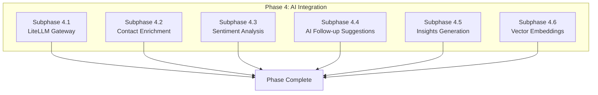

# Phase 4: AI Integration & Intelligence Layer

## Document Information

- **Project**: Weople - Professional Relationship Management Platform
- **Phase**: 4 - AI Integration & Intelligence Layer
- **Version**: 1.0.0
- **Last Updated**: 2026-01-29
- **Status**: Draft
- **Prerequisite**: Phase 1-3 must be complete

---

## Phase Overview

This phase implements the AI capabilities including the LiteLLM gateway, contact enrichment, sentiment analysis, follow-up suggestions, and insights generation. All subphases are **MECE** and can run **in parallel**.



---

## Subphase 4.1: LiteLLM Gateway

### Objective

Implement the AI gateway with LiteLLM for unified model access, cost control, and fallback chain.

### Files to Create:

| File Path                                              | Description            |
| ------------------------------------------------------ | ---------------------- |
| `apps/api/supabase/functions/ai-gateway/index.ts`      | LiteLLM Edge Function  |
| `libs/shared/data-access/src/lib/ai/litellm.client.ts` | LiteLLM client         |
| `libs/shared/data-access/src/lib/ai/litellm.config.ts` | Gateway configuration  |
| `libs/shared/data-access/src/lib/ai/cost-tracker.ts`   | Cost tracking service  |
| `supabase/functions/ai-gateway/config.toml`            | Function configuration |

### Key Implementation:

```typescript
// libs/shared/data-access/src/lib/ai/litellm.config.ts
export interface LiteLLMConfig {
  models: {
    enrichment: ModelConfig;
    sentiment: ModelConfig;
    reasoning: ModelConfig;
    embeddings: ModelConfig;
  };
  budget: {
    perUserMonthly: number;
    alertThreshold: number;
  };
  privacy: {
    strict: string[];
    balanced: string[];
    permissive: string[];
  };
}

export interface ModelConfig {
  primary: string;
  fallback: string[];
  cloud: string;
}

export const defaultConfig: LiteLLMConfig = {
  models: {
    enrichment: {
      primary: 'ollama/llama3.2',
      fallback: ['hosted/llama3.1'],
      cloud: 'openai/gpt-4o-mini',
    },
    sentiment: {
      primary: 'ollama/llama3.2',
      fallback: ['hosted/llama3.1'],
      cloud: 'openai/gpt-4o-mini',
    },
    reasoning: {
      primary: 'hosted/llama3.1-70b',
      fallback: ['openai/gpt-4o'],
      cloud: 'openai/gpt-4o',
    },
    embeddings: {
      primary: 'hosted/sentence-transformers',
      fallback: [],
      cloud: 'openai/text-embedding-3-small',
    },
  },
  budget: {
    perUserMonthly: 5.0,
    alertThreshold: 0.8,
  },
  privacy: {
    strict: ['local-only'],
    balanced: ['local', 'hosted'],
    permissive: ['local', 'hosted', 'cloud'],
  },
};
```

### Acceptance Criteria

- [ ] LiteLLM proxy configured
- [ ] Model routing working
- [ ] Cost tracking per user
- [ ] Budget alerts at 80%
- [ ] Fallback chain operational
- [ ] Privacy level enforcement

---

## Subphase 4.2: Contact Enrichment

### Objective

Implement AI-powered contact enrichment for job title, company, industry, and bio suggestions.

### Files to Create:

| File Path                                                     | Description          |
| ------------------------------------------------------------- | -------------------- |
| `libs/shared/data-access/src/lib/ai/enrichment.service.ts`    | Enrichment service   |
| `apps/api/supabase/functions/enrich-contact/index.ts`         | Edge Function        |
| `apps/web/src/lib/components/ai/EnrichmentSuggestions.svelte` | Suggestion UI        |
| `apps/web/src/lib/components/ai/ConfidenceBadge.svelte`       | Confidence indicator |

### Key Implementation:

```typescript
// libs/shared/data-access/src/lib/ai/enrichment.service.ts
import type { AIEnrichmentResult, Contact } from '@weople/types';
import { LiteLLMClient } from './litellm.client';

export class EnrichmentService {
  constructor(private llmClient: LiteLLMClient) {}

  async enrichContact(contact: Partial<Contact>): Promise<AIEnrichmentResult> {
    const prompt = this.buildEnrichmentPrompt(contact);

    const response = await this.llmClient.completion({
      model: 'enrichment-model',
      messages: [{ role: 'user', content: prompt }],
      temperature: 0.3,
    });

    return this.parseEnrichmentResponse(response.content);
  }

  private buildEnrichmentPrompt(contact: Partial<Contact>): string {
    return `Given the following contact information, suggest professional details:
Name: ${contact.name}
Email: ${contact.email || 'Unknown'}
Current Company: ${contact.company || 'Unknown'}
Current Title: ${contact.job_title || 'Unknown'}

Please provide suggestions in JSON format:
{
  "job_title": { "value": "...", "confidence": 0.0-1.0 },
  "company": { "value": "...", "confidence": 0.0-1.0 },
  "industry": { "value": "...", "confidence": 0.0-1.0 },
  "bio": { "value": "...", "confidence": 0.0-1.0 }
}`;
  }

  private parseEnrichmentResponse(content: string): AIEnrichmentResult {
    try {
      const json = JSON.parse(content);
      return {
        job_title: json.job_title?.value
          ? {
              value: json.job_title.value,
              confidence: Math.max(0, Math.min(1, json.job_title.confidence)),
            }
          : undefined,
        company: json.company?.value
          ? {
              value: json.company.value,
              confidence: Math.max(0, Math.min(1, json.company.confidence)),
            }
          : undefined,
        industry: json.industry?.value
          ? {
              value: json.industry.value,
              confidence: Math.max(0, Math.min(1, json.industry.confidence)),
            }
          : undefined,
        bio: json.bio?.value
          ? {
              value: json.bio.value,
              confidence: Math.max(0, Math.min(1, json.bio.confidence)),
            }
          : undefined,
      };
    } catch {
      return { suggestions: {} };
    }
  }
}
```

### Acceptance Criteria

- [ ] Enrichment suggestions on contact create
- [ ] Confidence scores displayed
- [ ] Accept/reject individual suggestions
- [ ] High confidence auto-apply option
- [ ] User can disable AI enrichment

---

## Subphase 4.3: Sentiment Analysis

### Objective

Implement sentiment analysis for interaction notes with scoring and topic extraction.

### Files to Create:

| File Path                                                        | Description                |
| ---------------------------------------------------------------- | -------------------------- |
| `libs/shared/data-access/src/lib/ai/sentiment.service.ts`        | Sentiment analysis service |
| `apps/api/supabase/functions/analyze-sentiment/index.ts`         | Edge Function              |
| `apps/web/src/lib/components/interactions/SentimentBadge.svelte` | Sentiment display          |

### Acceptance Criteria

- [ ] Sentiment score -1 to +1
- [ ] Categories: very_neg/neg/neutral/pos/very_pos
- [ ] Color-coded indicators
- [ ] Topics extracted
- [ ] Action items identified
- [ ] Batch analysis support

---

## Subphase 4.4: AI Follow-up Suggestions

### Objective

Implement AI-generated follow-up suggestions based on interaction patterns and context.

### Files to Create:

| File Path                                                           | Description        |
| ------------------------------------------------------------------- | ------------------ |
| `libs/shared/data-access/src/lib/ai/followup-suggestion.service.ts` | Suggestion service |
| `apps/api/supabase/functions/suggest-followup/index.ts`             | Edge Function      |
| `apps/web/src/lib/components/followups/AISuggestionCard.svelte`     | Suggestion UI      |

### Acceptance Criteria

- [ ] Context-aware suggestions
- [ ] Optimal timing recommendations
- [ ] Historical response rate analysis
- [ ] Accept/modify/dismiss workflow
- [ ] Suggestion quality feedback

---

## Subphase 4.5: Insights Generation

### Objective

Implement AI-generated insights about networking patterns, at-risk relationships, and recommendations.

### Files to Create:

| File Path                                                 | Description      |
| --------------------------------------------------------- | ---------------- |
| `libs/shared/data-access/src/lib/ai/insights.service.ts`  | Insights service |
| `apps/api/supabase/functions/generate-insights/index.ts`  | Edge Function    |
| `apps/web/src/lib/components/dashboard/AIInsights.svelte` | Insights widget  |

### Acceptance Criteria

- [ ] Natural language insights
- [ ] At-risk relationship alerts
- [ ] Personalized recommendations
- [ ] Network growth suggestions
- [ ] Weekly/monthly reports

---

## Subphase 4.6: Vector Embeddings

### Objective

Implement vector embeddings for contact similarity search and duplicate detection.

### Files to Create:

| File Path                                                      | Description             |
| -------------------------------------------------------------- | ----------------------- |
| `libs/shared/data-access/src/lib/vector/embedding.service.ts`  | Embedding generation    |
| `libs/shared/data-access/src/lib/vector/vector-db.service.ts`  | Qdrant/Weaviate adapter |
| `libs/shared/data-access/src/lib/vector/similarity.service.ts` | Similarity search       |

### Acceptance Criteria

- [ ] Embeddings generated for contacts
- [ ] Similarity search functional
- [ ] Duplicate detection via vectors
- [ ] Qdrant/Weaviate integration
- [ ] Batch embedding updates

---

## Phase Exit Criteria

1. [ ] LiteLLM gateway operational
2. [ ] Contact enrichment working
3. [ ] Sentiment analysis accurate
4. [ ] Follow-up suggestions relevant
5. [ ] Insights generation functional
6. [ ] Vector search operational
7. [ ] Cost tracking accurate
8. [ ] 80%+ test coverage
9. [ ] PR merged to main

---

## Post-Phase Report Template

```markdown
## Phase 4 Completion Report

### Summary

- Date Completed: [DATE]
- AI Features: [COUNT]
- Test Coverage: [PERCENTAGE]
- Avg Cost/User: [AMOUNT]

### Subphase Status

| Subphase       | Status   |
| -------------- | -------- |
| 4.1 Gateway    | [STATUS] |
| 4.2 Enrichment | [STATUS] |
| 4.3 Sentiment  | [STATUS] |
| 4.4 Follow-ups | [STATUS] |
| 4.5 Insights   | [STATUS] |
| 4.6 Embeddings | [STATUS] |

### PR Link

[Link to merged PR]
```
