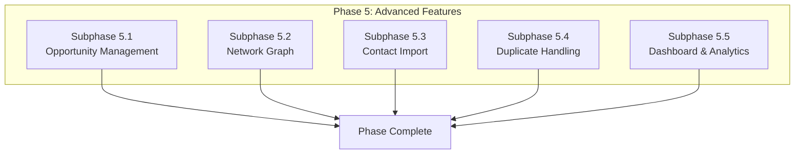

# Phase 5: Advanced Features - Opportunities & Network Graph

## Document Information

- **Project**: Weople - Professional Relationship Management Platform
- **Phase**: 5 - Advanced Features
- **Version**: 1.0.0
- **Last Updated**: 2026-01-29
- **Status**: Draft
- **Prerequisite**: Phase 1-4 must be complete

---

## Phase Overview

This phase implements advanced features including opportunity management, network graph visualization, duplicate handling, contact import, and dashboard. All subphases are **MECE** and can run **in parallel**.



---

## Subphase 5.1: Opportunity Management

### Objective

Implement complete opportunity pipeline management with kanban board, analytics, and AI detection.

### Files to Create

| File Path                                                             | Description        |
| --------------------------------------------------------------------- | ------------------ |
| `libs/shared/data-access/src/lib/services/opportunity.service.ts`     | Opportunity CRUD   |
| `apps/web/feature-opportunities/src/lib/OpportunityPipeline.svelte`   | Kanban board       |
| `apps/web/feature-opportunities/src/lib/OpportunityCard.svelte`       | Opportunity card   |
| `apps/web/feature-opportunities/src/lib/OpportunityForm.svelte`       | Create/edit form   |
| `apps/web/feature-opportunities/src/lib/OpportunityAnalytics.svelte`  | Analytics view     |
| `apps/web/src/routes/(app)/opportunities/+page.svelte`                | Opportunities page |
| `libs/shared/data-access/src/lib/ai/opportunity-detection.service.ts` | AI detection       |

### Acceptance Criteria

- [ ] Pipeline stages: prospecting → closed
- [ ] Drag-and-drop kanban board
- [ ] Contact linking with roles
- [ ] Value tracking with currency
- [ ] Win/loss analytics
- [ ] AI opportunity detection
- [ ] Pipeline conversion rates

---

## Subphase 5.2: Network Graph

### Objective

Implement Oxigraph integration for network visualization and warm introduction path finding.

### Files to Create

| File Path                                                           | Description         |
| ------------------------------------------------------------------- | ------------------- |
| `libs/shared/data-access/src/lib/adapters/oxigraph.adapter.ts`      | Oxigraph adapter    |
| `libs/shared/data-access/src/lib/services/network-graph.service.ts` | Graph service       |
| `apps/web/feature-network/src/lib/NetworkGraph.svelte`              | Graph visualization |
| `apps/web/feature-network/src/lib/IntroductionPath.svelte`          | Path finder UI      |
| `apps/web/feature-network/src/lib/NetworkMetrics.svelte`            | Metrics display     |

### Acceptance Criteria

- [ ] RDF triple store synced
- [ ] SPARQL queries functional
- [ ] Network visualization (D3/Cytoscape)
- [ ] Path finding for introductions
- [ ] Centrality calculations
- [ ] Community detection
- [ ] Relationship strength tracking

---

## Subphase 5.3: Contact Import

### Objective

Implement contact import from Google, LinkedIn, and CSV with duplicate resolution.

### Files to Create

| File Path                                                    | Description             |
| ------------------------------------------------------------ | ----------------------- |
| `libs/shared/data-access/src/lib/import/import.service.ts`   | Import orchestrator     |
| `libs/shared/data-access/src/lib/import/google.adapter.ts`   | Google Contacts adapter |
| `libs/shared/data-access/src/lib/import/linkedin.adapter.ts` | LinkedIn adapter        |
| `libs/shared/data-access/src/lib/import/csv.adapter.ts`      | CSV parser              |
| `apps/web/feature-import/src/lib/ImportWizard.svelte`        | Multi-step wizard       |
| `apps/web/feature-import/src/lib/DuplicateResolver.svelte`   | Resolution UI           |
| `apps/web/feature-import/src/lib/ImportPreview.svelte`       | Preview component       |

### Acceptance Criteria

- [ ] OAuth import from Google
- [ ] OAuth import from LinkedIn
- [ ] CSV upload (vCard format)
- [ ] Duplicate detection preview
- [ ] Merge/skip/import options
- [ ] Progress tracking
- [ ] Import limits enforced
- [ ] Undo import (24hr)

---

## Subphase 5.4: Duplicate Handling

### Objective

Implement comprehensive duplicate detection and merge functionality.

### Files to Create

| File Path                                                       | Description         |
| --------------------------------------------------------------- | ------------------- |
| `libs/shared/data-access/src/lib/services/duplicate.service.ts` | Duplicate detection |
| `libs/shared/data-access/src/lib/services/merge.service.ts`     | Merge orchestration |
| `apps/web/feature-duplicates/src/lib/DuplicateList.svelte`      | Duplicate review    |
| `apps/web/feature-duplicates/src/lib/MergePreview.svelte`       | Merge preview       |
| `apps/web/feature-duplicates/src/lib/FieldSelector.svelte`      | Field conflict UI   |

### Acceptance Criteria

- [ ] Email matching
- [ ] Phone matching
- [ ] Name+company similarity
- [ ] Vector similarity (HNSW)
- [ ] Confidence scoring
- [ ] Side-by-side comparison
- [ ] Selective field merge
- [ ] Undo merge (24hr)

---

## Subphase 5.5: Dashboard & Analytics

### Objective

Implement comprehensive dashboard with widgets, charts, and real-time updates.

### Files to Create

| File Path                                                               | Description         |
| ----------------------------------------------------------------------- | ------------------- |
| `apps/web/src/routes/(app)/dashboard/+page.svelte`                      | Dashboard page      |
| `apps/web/feature-dashboard/src/lib/DashboardGrid.svelte`               | Widget grid         |
| `apps/web/feature-dashboard/src/lib/widgets/NetworkSizeWidget.svelte`   | Network stats       |
| `apps/web/feature-dashboard/src/lib/widgets/HealthWidget.svelte`        | Health distribution |
| `apps/web/feature-dashboard/src/lib/widgets/ActivityWidget.svelte`      | Recent activity     |
| `apps/web/feature-dashboard/src/lib/widgets/FollowUpsWidget.svelte`     | Upcoming follow-ups |
| `apps/web/feature-dashboard/src/lib/widgets/OpportunitiesWidget.svelte` | Pipeline value      |
| `apps/web/feature-dashboard/src/lib/charts/NetworkGrowthChart.svelte`   | Growth chart        |
| `apps/web/feature-dashboard/src/lib/charts/InteractionChart.svelte`     | Activity chart      |

### Acceptance Criteria

- [ ] Network size widget
- [ ] Health distribution chart
- [ ] Recent activity summary
- [ ] Upcoming follow-ups
- [ ] Active opportunities
- [ ] Tag distribution
- [ ] Network growth over time
- [ ] Interaction frequency chart
- [ ] Real-time updates
- [ ] Widget customization (drag-drop)

---

## Phase Exit Criteria

1. [ ] Opportunity pipeline functional
2. [ ] Network graph operational
3. [ ] Contact import working
4. [ ] Duplicate detection accurate
5. [ ] Dashboard complete
6. [ ] Analytics accurate
7. [ ] 80%+ test coverage
8. [ ] PR merged to main

---

## Post-Phase Report Template

```markdown
## Phase 5 Completion Report

### Summary

- Date Completed: [DATE]
- Features Implemented: [COUNT]
- Test Coverage: [PERCENTAGE]

### Subphase Status

| Subphase          | Status   |
| ----------------- | -------- |
| 5.1 Opportunities | [STATUS] |
| 5.2 Network Graph | [STATUS] |
| 5.3 Import        | [STATUS] |
| 5.4 Duplicates    | [STATUS] |
| 5.5 Dashboard     | [STATUS] |

### PR Link

[Link to merged PR]
```
