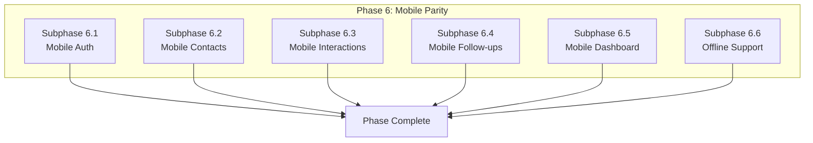

# Phase 6: Mobile Platform Parity

## Document Information

- **Project**: Weople - Professional Relationship Management Platform
- **Phase**: 6 - Mobile Platform Parity
- **Version**: 1.0.0
- **Last Updated**: 2026-01-29
- **Status**: Draft
- **Prerequisite**: Phase 1-5 must be complete

---

## Phase Overview

This phase brings mobile to feature parity with web, implementing all core features for React Native. Subphases are **MECE** and can run **in parallel**.



---

## Subphase 6.1: Mobile Authentication

### Objective

Implement complete auth flow for mobile with biometric support.

### Files to Create:

| File Path                                           | Description         |
| --------------------------------------------------- | ------------------- |
| `apps/mobile/src/features/auth/LoginScreen.tsx`     | Login screen        |
| `apps/mobile/src/features/auth/RegisterScreen.tsx`  | Registration screen |
| `apps/mobile/src/features/auth/BiometricScreen.tsx` | Biometric prompt    |
| `apps/mobile/src/navigation/AuthNavigator.tsx`      | Auth navigation     |
| `apps/mobile/src/stores/auth.store.ts`              | Auth state          |

### Acceptance Criteria

- [ ] Email/password login
- [ ] OAuth (Google, LinkedIn)
- [ ] Biometric authentication
- [ ] Secure token storage
- [ ] Auto-login with biometrics

---

## Subphase 6.2: Mobile Contacts

### Objective

Implement contact management for mobile.

### Files to Create:

| File Path                                                      | Description      |
| -------------------------------------------------------------- | ---------------- |
| `apps/mobile/feature-contacts/src/lib/ContactsScreen.tsx`      | Contacts list    |
| `apps/mobile/feature-contacts/src/lib/ContactDetailScreen.tsx` | Detail view      |
| `apps/mobile/feature-contacts/src/lib/ContactFormScreen.tsx`   | Add/edit form    |
| `apps/mobile/feature-contacts/src/lib/ContactCard.tsx`         | Card component   |
| `apps/mobile/feature-contacts/src/lib/SearchBar.tsx`           | Search component |

### Acceptance Criteria

- [ ] Contact list with search
- [ ] Pull-to-refresh
- [ ] Infinite scroll
- [ ] Swipe actions (edit/delete)
- [ ] Contact detail view
- [ ] Add/edit contact

---

## Subphase 6.3: Mobile Interactions

### Objective

Implement interaction logging and timeline for mobile.

### Files to Create:

| File Path                                                           | Description    |
| ------------------------------------------------------------------- | -------------- |
| `apps/mobile/feature-interactions/src/lib/InteractionTimeline.tsx`  | Timeline view  |
| `apps/mobile/feature-interactions/src/lib/LogInteractionScreen.tsx` | Log form       |
| `apps/mobile/feature-interactions/src/lib/InteractionCard.tsx`      | Card component |
| `apps/mobile/feature-interactions/src/lib/QuickLogButton.tsx`       | FAB            |

### Acceptance Criteria

- [ ] Timeline view
- [ ] Quick log FAB
- [ ] Log interaction form
- [ ] Sentiment display
- [ ] Swipe to edit/delete

---

## Subphase 6.4: Mobile Follow-ups

### Objective

Implement follow-up reminders for mobile.

### Files to Create:

| File Path                                                     | Description        |
| ------------------------------------------------------------- | ------------------ |
| `apps/mobile/feature-followups/src/lib/FollowUpsScreen.tsx`   | List screen        |
| `apps/mobile/feature-followups/src/lib/FollowUpCard.tsx`      | Card component     |
| `apps/mobile/feature-followups/src/lib/AddFollowUpScreen.tsx` | Add form           |
| `apps/mobile/src/services/push-notifications.ts`              | Push notifications |

### Acceptance Criteria

- [ ] Follow-ups list
- [ ] Push notifications
- [ ] Swipe to complete
- [ ] Badge counts
- [ ] Snooze options

---

## Subphase 6.5: Mobile Dashboard

### Objective

Implement mobile-optimized dashboard.

### Files to Create:

| File Path                                                  | Description   |
| ---------------------------------------------------------- | ------------- |
| `apps/mobile/src/features/dashboard/DashboardScreen.tsx`   | Dashboard     |
| `apps/mobile/src/features/dashboard/StatsCard.tsx`         | Stat cards    |
| `apps/mobile/src/features/dashboard/RecentActivity.tsx`    | Activity list |
| `apps/mobile/src/features/dashboard/UpcomingFollowUps.tsx` | Follow-ups    |

### Acceptance Criteria

- [ ] Network stats
- [ ] Health overview
- [ ] Recent activity
- [ ] Upcoming follow-ups
- [ ] Pull-to-refresh

---

## Subphase 6.6: Offline Support

### Objective

Implement offline-first architecture for mobile.

### Files to Create:

| File Path                                                    | Description          |
| ------------------------------------------------------------ | -------------------- |
| `libs/shared/data-access/src/lib/offline/sync.service.ts`    | Sync service         |
| `libs/shared/data-access/src/lib/offline/queue.service.ts`   | Operation queue      |
| `libs/shared/data-access/src/lib/offline/storage.adapter.ts` | AsyncStorage adapter |
| `apps/mobile/src/services/background-sync.ts`                | Background sync      |
| `apps/mobile/src/components/OfflineIndicator.tsx`            | Offline banner       |

### Acceptance Criteria

- [ ] Offline data caching
- [ ] Operation queue
- [ ] Background sync
- [ ] Conflict resolution
- [ ] Offline indicator
- [ ] Full offline support

---

## Phase Exit Criteria

1. [ ] All web features on mobile
2. [ ] Biometric auth working
3. [ ] Push notifications
4. [ ] Offline support
5. [ ] 80%+ test coverage
6. [ ] PR merged to main

---

## Post-Phase Report Template

```markdown
## Phase 6 Completion Report

### Summary

- Date Completed: [DATE]
- Screens Implemented: [COUNT]
- Test Coverage: [PERCENTAGE]

### Subphase Status

| Subphase                | Status   |
| ----------------------- | -------- |
| 6.1 Mobile Auth         | [STATUS] |
| 6.2 Mobile Contacts     | [STATUS] |
| 6.3 Mobile Interactions | [STATUS] |
| 6.4 Mobile Follow-ups   | [STATUS] |
| 6.5 Mobile Dashboard    | [STATUS] |
| 6.6 Offline Support     | [STATUS] |

### PR Link

[Link to merged PR]
```
