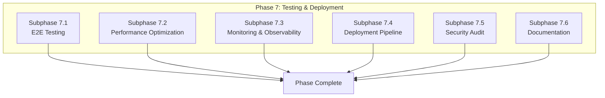

# Phase 7: Performance, Testing & Deployment

## Document Information

- **Project**: Weople - Professional Relationship Management Platform
- **Phase**: 7 - Performance, Testing & Deployment
- **Version**: 1.0.0
- **Last Updated**: 2026-01-29
- **Status**: Draft
- **Prerequisite**: Phase 1-6 must be complete

---

## Phase Overview

This final phase focuses on performance optimization, comprehensive testing, monitoring setup, and production deployment. Subphases can run **in parallel** after initial setup.



---

## Subphase 7.1: E2E Testing

### Objective

Implement comprehensive end-to-end tests with Playwright (web) and Maestro (mobile).

### Files to Create

| File Path                               | Description           |
| --------------------------------------- | --------------------- |
| `apps/web-e2e/playwright.config.ts`     | Playwright config     |
| `apps/web-e2e/src/auth.spec.ts`         | Auth flows            |
| `apps/web-e2e/src/contacts.spec.ts`     | Contact CRUD          |
| `apps/web-e2e/src/interactions.spec.ts` | Interaction flow      |
| `apps/mobile-e2e/flows/auth.yaml`       | Maestro auth flow     |
| `apps/mobile-e2e/flows/contacts.yaml`   | Maestro contacts flow |
| `.github/workflows/e2e.yml`             | CI workflow           |

### Test Coverage Requirements

| Feature      | Critical Path              | Full Coverage                      |
| ------------ | -------------------------- | ---------------------------------- |
| Auth         | Login, Register, Logout    | OAuth, Reset password, Biometric   |
| Contacts     | Create, View, Edit, Delete | Import, Merge, Duplicate detection |
| Interactions | Log interaction            | Timeline, Sentiment                |
| Follow-ups   | Create, Complete           | AI suggestions, Notifications      |
| Dashboard    | View dashboard             | Widgets, Real-time updates         |

### Acceptance Criteria

- [ ] Playwright tests for web
- [ ] Maestro tests for mobile
- [ ] 90%+ critical path coverage
- [ ] CI/CD integration
- [ ] Parallel test execution
- [ ] Visual regression tests

---

## Subphase 7.2: Performance Optimization

### Objective

Optimize application performance to meet PRD requirements.

### PRD Performance Targets

| Metric              | Target                        |
| ------------------- | ----------------------------- |
| Page Load Time      | < 2s (3G)                     |
| Time to Interactive | < 3s                          |
| API Response Time   | < 200ms (95th percentile)     |
| Contact List Scroll | 60fps                         |
| Search Response     | < 100ms local, < 500ms server |

### Files to Create/Modify

| File Path                                                | Description         |
| -------------------------------------------------------- | ------------------- |
| `libs/shared/performance/src/lib/metrics.ts`             | Performance metrics |
| `apps/web/src/hooks.client.ts`                           | Web vitals tracking |
| `apps/web/src/lib/components/VirtualList.svelte`         | Virtualized lists   |
| `libs/shared/data-access/src/lib/cache/cache.service.ts` | Caching layer       |

### Optimization Tasks

1. **Bundle Optimization**
   - Code splitting by route
   - Tree shaking
   - Dynamic imports for heavy components

2. **Rendering Optimization**
   - Virtualized contact lists
   - Memoized components
   - Debounced search

3. **Data Optimization**
   - Request batching
   - Optimistic updates
   - Caching strategy

4. **Asset Optimization**
   - Image optimization
   - Font loading strategy
   - Asset preloading

### Acceptance Criteria

- [ ] Lighthouse score 90+
- [ ] Web Vitals in "Good" range
- [ ] 60fps scrolling
- [ ] < 200ms API responses
- [ ] Bundle size < 200KB initial

---

## Subphase 7.3: Monitoring & Observability

### Objective

Implement comprehensive monitoring using open source tools per ADR-014.

### Files to Create

| File Path                                         | Description        |
| ------------------------------------------------- | ------------------ |
| `libs/shared/monitoring/src/lib/sentry.ts`        | Sentry integration |
| `libs/shared/monitoring/src/lib/opentelemetry.ts` | OTel setup         |
| `libs/shared/monitoring/src/lib/logger.ts`        | Structured logging |
| `tools/infra/src/lib/openobserve.ts`              | OpenObserve config |
| `tools/infra/src/lib/grafana.ts`                  | Grafana dashboards |
| `docker/monitoring/docker-compose.yml`            | Monitoring stack   |

### Monitoring Stack

```yaml
# docker/monitoring/docker-compose.yml
version: '3.8'
services:
  openobserve:
    image: openobserve/openobserve:latest
    ports:
      - '5080:5080'
    volumes:
      - openobserve-data:/data

  sentry:
    image: getsentry/sentry:latest
    ports:
      - '9000:9000'

  jaeger:
    image: jaegertracing/all-in-one:latest
    ports:
      - '16686:16686'

  prometheus:
    image: prom/prometheus:latest
    ports:
      - '9090:9090'
    volumes:
      - ./prometheus.yml:/etc/prometheus/prometheus.yml

  grafana:
    image: grafana/grafana:latest
    ports:
      - '3000:3000'
    volumes:
      - grafana-data:/var/lib/grafana
```

### Acceptance Criteria

- [ ] Error tracking (Sentry)
- [ ] Log aggregation (OpenObserve)
- [ ] Distributed tracing (Jaeger)
- [ ] Metrics collection (Prometheus)
- [ ] Dashboards (Grafana)
- [ ] Alerting configured

---

## Subphase 7.4: Deployment Pipeline

### Objective

Set up complete CI/CD pipeline for web and mobile deployment.

### Files to Create

| File Path                               | Description        |
| --------------------------------------- | ------------------ |
| `.github/workflows/ci.yml`              | CI pipeline        |
| `.github/workflows/deploy-web.yml`      | Web deployment     |
| `.github/workflows/deploy-mobile.yml`   | Mobile deployment  |
| `.github/workflows/deploy-supabase.yml` | DB deployment      |
| `tools/infra/src/lib/deployment.ts`     | Deployment scripts |
| `vercel.json`                           | Vercel config      |

### CI/CD Pipeline

```yaml
# .github/workflows/ci.yml
name: CI
on:
  push:
    branches: [main, develop]
  pull_request:
    branches: [main]

jobs:
  lint:
    runs-on: ubuntu-latest
    steps:
      - uses: actions/checkout@v4
      - uses: actions/setup-node@v4
      - run: npm ci
      - run: bunx nx affected:lint

  test:
    runs-on: ubuntu-latest
    steps:
      - uses: actions/checkout@v4
      - uses: actions/setup-node@v4
      - run: npm ci
      - run: bunx nx affected:test --coverage
      - uses: codecov/codecov-action@v3

  e2e:
    runs-on: ubuntu-latest
    steps:
      - uses: actions/checkout@v4
      - uses: actions/setup-node@v4
      - run: npm ci
      - run: npx playwright install
      - run: bunx nx e2e web-e2e

  build:
    runs-on: ubuntu-latest
    needs: [lint, test]
    steps:
      - uses: actions/checkout@v4
      - uses: actions/setup-node@v4
      - run: npm ci
      - run: bunx nx affected:build
```

### Deployment Strategy

| Environment | Branch  | Trigger         |
| ----------- | ------- | --------------- |
| Development | develop | Auto on push    |
| Staging     | main    | Auto on push    |
| Production  | main    | Manual approval |

### Acceptance Criteria

- [ ] CI pipeline passing
- [ ] Automated deployments
- [ ] Rollback capability
- [ ] Environment promotion
- [ ] Database migrations automated
- [ ] Mobile app store deployment

---

## Subphase 7.5: Security Audit

### Objective

Conduct comprehensive security audit and implement fixes.

### Audit Checklist

| Category       | Check                    |
| -------------- | ------------------------ |
| Auth           | Password policy enforced |
| Auth           | JWT validation           |
| Auth           | Session management       |
| Auth           | Rate limiting            |
| Database       | RLS policies active      |
| Database       | SQL injection prevention |
| API            | Input validation         |
| API            | CORS configuration       |
| Frontend       | XSS prevention           |
| Frontend       | CSRF tokens              |
| Frontend       | CSP headers              |
| Infrastructure | Secrets management       |
| Infrastructure | TLS 1.3                  |
| Infrastructure | Security headers         |

### Files to Review/Create

| File Path                        | Description       |
| -------------------------------- | ----------------- |
| `security/audit-report.md`       | Audit findings    |
| `security/fixes/*.md`            | Fix documentation |
| `.zap/rules.tsv`                 | ZAP scan rules    |
| `.github/workflows/security.yml` | Security scanning |

### Acceptance Criteria

- [ ] Penetration test passed
- [ ] Dependency vulnerabilities fixed
- [ ] Security headers configured
- [ ] CSP implemented
- [ ] Secrets rotated
- [ ] GDPR compliance verified

---

## Subphase 7.6: Documentation

### Objective

Complete all project documentation for handoff and maintenance.

### Files to Create

| File Path                          | Description           |
| ---------------------------------- | --------------------- |
| `docs/README.md`                   | Documentation index   |
| `docs/development/setup.md`        | Developer setup       |
| `docs/development/architecture.md` | Architecture overview |
| `docs/development/testing.md`      | Testing guide         |
| `docs/operations/deployment.md`    | Deployment guide      |
| `docs/operations/monitoring.md`    | Monitoring guide      |
| `docs/operations/runbooks.md`      | Incident runbooks     |
| `docs/api/README.md`               | API documentation     |
| `docs/api/authentication.md`       | Auth docs             |
| `docs/api/endpoints.md`            | Endpoint reference    |

### Acceptance Criteria

- [ ] Developer onboarding docs
- [ ] API documentation
- [ ] Architecture diagrams
- [ ] Runbooks created
- [ ] Changelog maintained
- [ ] License file present

---

## Phase Exit Criteria

1. [ ] E2E tests passing
2. [ ] Performance targets met
3. [ ] Monitoring operational
4. [ ] Deployment automated
5. [ ] Security audit passed
6. [ ] Documentation complete
7. [ ] 80%+ overall test coverage
8. [ ] Production deployed

---

## Project Completion Checklist

### MVP Features (Per PRD 8.1)

- [ ] US-01: Sign Up
- [ ] US-02: Login
- [ ] US-03: Add Contact
- [ ] US-04: Log Interaction
- [ ] US-05: Follow-up Reminders
- [ ] US-09: Dashboard Overview
- [ ] US-10: Account Management

### v1.0 Features (Per PRD 8.2)

- [ ] All user stories complete
- [ ] AI features integrated
- [ ] Mobile apps published
- [ ] 80% test coverage
- [ ] Security audit passed
- [ ] Performance benchmarks met

---

## Post-Phase Report Template

```markdown
# Phase 7 Completion Report - PROJECT COMPLETE

## Summary

- Date Completed: [DATE]
- Total Phases: 7
- Total Files Created: [COUNT]
- Overall Test Coverage: [PERCENTAGE]

## Subphase Status

| Subphase          | Status   |
| ----------------- | -------- |
| 7.1 E2E Testing   | [STATUS] |
| 7.2 Performance   | [STATUS] |
| 7.3 Monitoring    | [STATUS] |
| 7.4 Deployment    | [STATUS] |
| 7.5 Security      | [STATUS] |
| 7.6 Documentation | [STATUS] |

## Performance Metrics

| Metric        | Target  | Achieved |
| ------------- | ------- | -------- |
| Page Load     | < 2s    | [VALUE]  |
| API Response  | < 200ms | [VALUE]  |
| Test Coverage | 80%     | [VALUE]  |

## Deployment Status

| Environment    | Status   | URL        |
| -------------- | -------- | ---------- |
| Production     | [STATUS] | [URL]      |
| Mobile iOS     | [STATUS] | App Store  |
| Mobile Android | [STATUS] | Play Store |

## Lessons Learned

- [LESSON 1]
- [LESSON 2]

## Recommendations

- [RECOMMENDATION 1]
- [RECOMMENDATION 2]

## PR Link

[Link to final PR]
```
