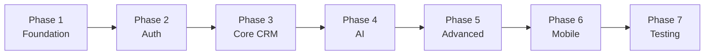
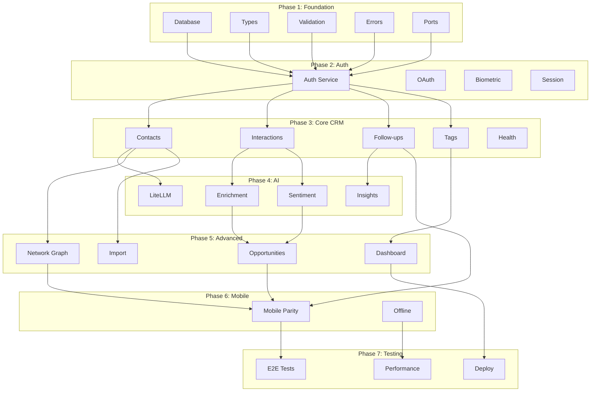

# Weople Platform - Implementation Plans

## Document Information

- **Project**: Weople - Professional Relationship Management Platform
- **Version**: 1.0.0
- **Last Updated**: 2026-01-29
- **Status**: Draft

---

## Overview

This directory contains comprehensive phased implementation plans for the Weople platform. Each plan follows a **MECE** (Mutually Exclusive, Collectively Exhaustive) structure with parallelizable subphases.

## Phase Structure



## Plan Documents

| Phase | Document                                                             | Description                                | Prerequisite |
| ----- | -------------------------------------------------------------------- | ------------------------------------------ | ------------ |
| 0     | [`00-gap-analysis.md`](./00-gap-analysis.md)                         | Current state analysis vs specs            | None         |
| 1     | [`01-phase-foundation.md`](./01-phase-foundation.md)                 | Database, types, validation, errors, ports | None         |
| 2     | [`02-phase-authentication.md`](./02-phase-authentication.md)         | Auth, OAuth, biometrics, sessions          | Phase 1      |
| 3     | [`03-phase-core-crm.md`](./03-phase-core-crm.md)                     | Contacts, interactions, follow-ups, tags   | Phase 1-2    |
| 4     | [`04-phase-ai-integration.md`](./04-phase-ai-integration.md)         | LiteLLM, enrichment, sentiment, insights   | Phase 1-3    |
| 5     | [`05-phase-advanced-features.md`](./05-phase-advanced-features.md)   | Opportunities, graph, import, dashboard    | Phase 1-4    |
| 6     | [`06-phase-mobile-parity.md`](./06-phase-mobile-parity.md)           | Mobile feature parity, offline             | Phase 1-5    |
| 7     | [`07-phase-testing-deployment.md`](./07-phase-testing-deployment.md) | E2E, performance, monitoring, deploy       | Phase 1-6    |

## Implementation Approach

### TDD Workflow

Each subphase follows Test-Driven Development:

```
RED    → Write failing tests
GREEN  → Implement minimal passing code
BLUE   → Refactor with quality improvements
REG    → Add regression tests
COMMIT → When phase complete
PR     → Create PR for review
```

### Parallel Execution

Subphases within each phase are MECE and can run in parallel using sub-agents:

```
Phase X:
├── Subphase X.1 → Agent A
├── Subphase X.2 → Agent B
├── Subphase X.3 → Agent C
└── Subphase X.4 → Agent D
```

### Phase Dependencies



## Phase Exit Criteria

Each phase must meet these criteria before proceeding:

1. ✅ All subphases complete
2. ✅ 80%+ test coverage
3. ✅ All tests passing
4. ✅ Code review completed
5. ✅ PR merged to main
6. ✅ Regression tests passed

## Progress Tracking

Use the following checklist to track progress:

```markdown
## Implementation Progress

### Phase 1: Foundation

- [ ] 1.1 Database Schema
- [ ] 1.2 Type Definitions
- [ ] 1.3 Validation Schemas
- [ ] 1.4 Error Handling
- [ ] 1.5 Port Interfaces

### Phase 2: Authentication

- [ ] 2.1 Email/Password Auth
- [ ] 2.2 OAuth Integration
- [ ] 2.3 Biometric Auth
- [ ] 2.4 Session Management
- [ ] 2.5 Profile Management

### Phase 3: Core CRM

- [ ] 3.1 Contacts Service & UI
- [ ] 3.2 Interactions & Timeline
- [ ] 3.3 Follow-ups & Reminders
- [ ] 3.4 Tagging System
- [ ] 3.5 Health Scoring

### Phase 4: AI Integration

- [ ] 4.1 LiteLLM Gateway
- [ ] 4.2 Contact Enrichment
- [ ] 4.3 Sentiment Analysis
- [ ] 4.4 AI Follow-up Suggestions
- [ ] 4.5 Insights Generation
- [ ] 4.6 Vector Embeddings

### Phase 5: Advanced Features

- [ ] 5.1 Opportunity Management
- [ ] 5.2 Network Graph
- [ ] 5.3 Contact Import
- [ ] 5.4 Duplicate Handling
- [ ] 5.5 Dashboard & Analytics

### Phase 6: Mobile Parity

- [ ] 6.1 Mobile Auth
- [ ] 6.2 Mobile Contacts
- [ ] 6.3 Mobile Interactions
- [ ] 6.4 Mobile Follow-ups
- [ ] 6.5 Mobile Dashboard
- [ ] 6.6 Offline Support

### Phase 7: Testing & Deployment

- [ ] 7.1 E2E Testing
- [ ] 7.2 Performance Optimization
- [ ] 7.3 Monitoring & Observability
- [ ] 7.4 Deployment Pipeline
- [ ] 7.5 Security Audit
- [ ] 7.6 Documentation
```

## File Count Estimates

| Phase     | New Files | Modified Files | Tests    |
| --------- | --------- | -------------- | -------- |
| 1         | ~50       | ~10            | ~100     |
| 2         | ~40       | ~5             | ~80      |
| 3         | ~60       | ~10            | ~120     |
| 4         | ~30       | ~5             | ~60      |
| 5         | ~50       | ~10            | ~100     |
| 6         | ~40       | ~5             | ~60      |
| 7         | ~30       | ~10            | ~80      |
| **Total** | **~300**  | **~55**        | **~600** |

## Getting Started

1. Review [`00-gap-analysis.md`](./00-gap-analysis.md) to understand current state
2. Start with [`01-phase-foundation.md`](./01-phase-foundation.md)
3. Each phase document contains:
   - Detailed requirements
   - File specifications with exact paths
   - Implementation code samples
   - TDD approach (RED → GREEN → BLUE → REG)
   - Acceptance criteria
   - Post-phase report template

## Reporting

After each phase:

1. Fill out the post-phase report template
2. Update this README progress checklist
3. Create PR with detailed description
4. Tag relevant stakeholders

## Questions?

Refer to the specifications:

- [`docs/specs/prd.md`](../specs/prd.md) - Product Requirements
- [`docs/specs/adr.md`](../specs/adr.md) - Architecture Decisions
- [`docs/specs/sds.md`](../specs/sds.md) - Software Design
