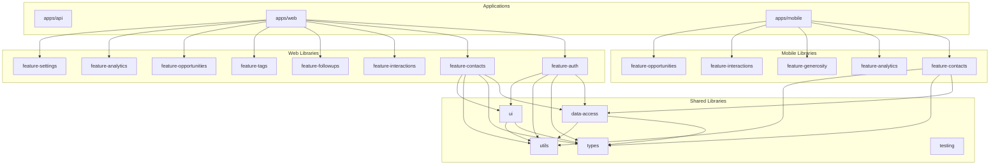
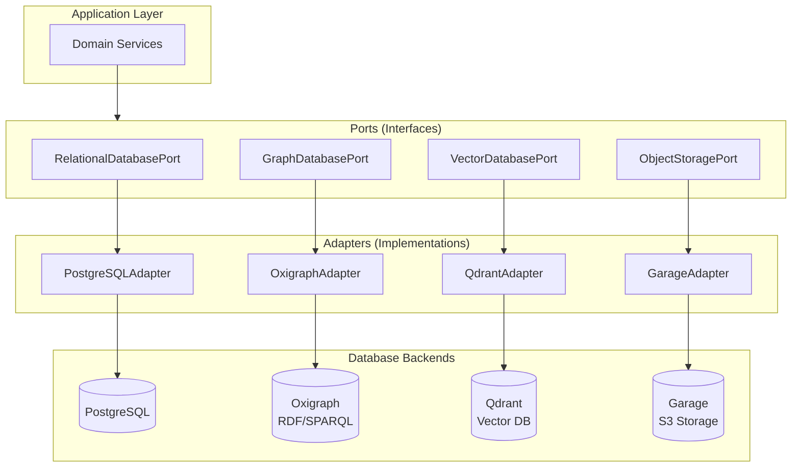
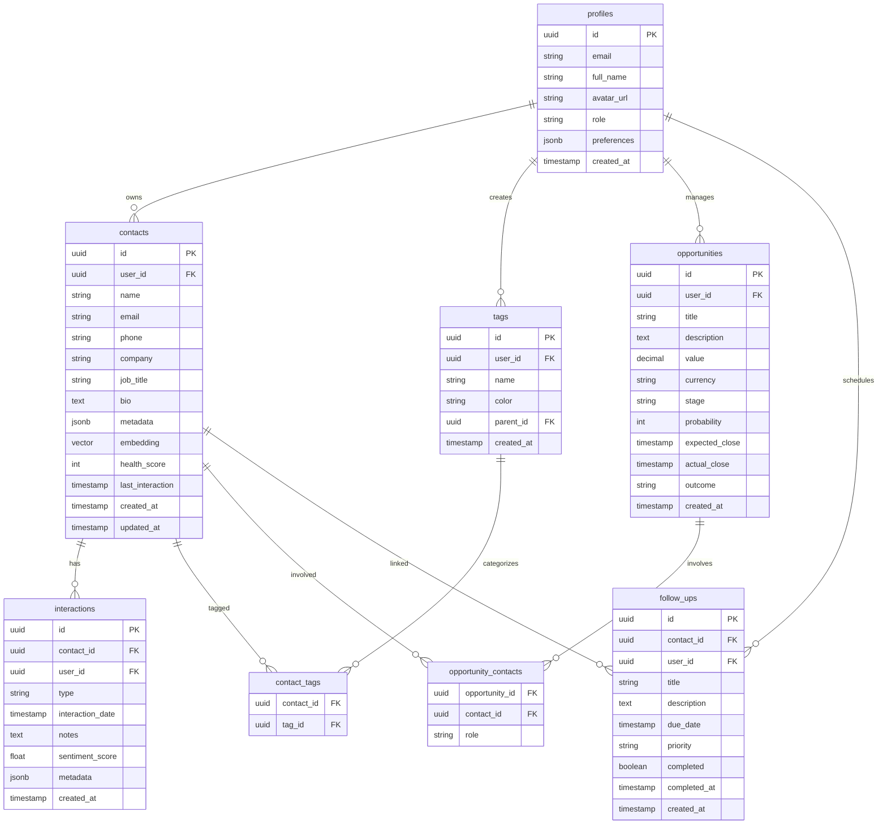
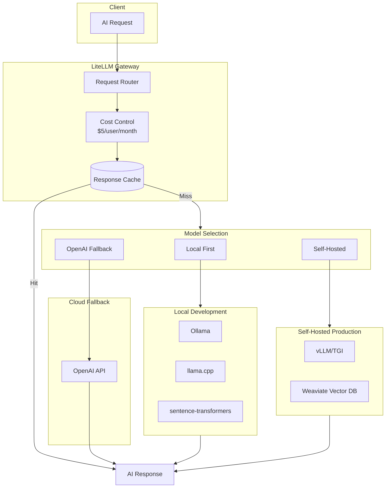
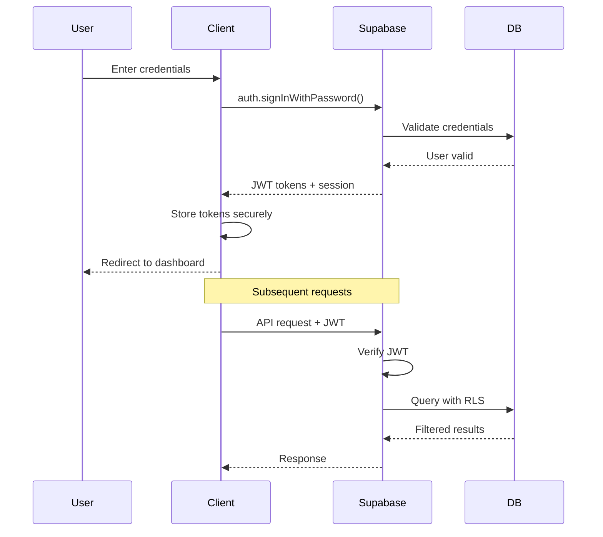

# Software Design Specification (SDS) - Weople Platform

## Document Information

- **Project**: Weople - Professional Relationship Management Platform
- **Version**: 1.0.0
- **Last Updated**: 2026-01-29
- **Status**: Draft

---

## 1. Introduction

### 1.1 Purpose

This Software Design Specification (SDS) provides detailed technical design guidance for implementing the Weople platform. It translates the Product Requirements Document (PRD) into actionable technical specifications for development teams.

### 1.2 Scope

This document covers:

- System architecture and component design
- Database schema and data flow
- API specifications
- Frontend component architecture
- AI integration patterns
- Security implementation
- Testing strategy

### 1.3 References

- **PRD**: Product Requirements Document (prd.md) - source of functional requirements
- **ADR**: Architecture Decision Records (adr.md) - architectural foundation
- **PDD**: Product Development Document (docs/temp/pdd.md) - implementation prompts

### 1.4 Traceability Legend

Each section references the PRD requirements it satisfies:

- `PRD-US-XX`: Product Requirement (User Story)
- `PRD-AC-XX.XX`: Acceptance Criteria
- `ADR-XXX`: Architecture Decision Record

---

## 2. System Architecture

### 2.1 High-Level Architecture

*Satisfies: PRD-US-01 through US-11, ADR-001, ADR-002*

```mermaid
flowchart TB
    subgraph Client["Client Layer"]
        Web["Web App<br/>SvelteKit"]
        Mobile["Mobile App<br/>React Native"]
    end

    subgraph Edge["Edge Layer"]
        CDN["CDN<br/>Static Assets"]
    end

    subgraph Backend["Backend Layer"]
        Supabase["Supabase Platform"]
        subgraph SupabaseComponents[""]
            Auth["Auth"]
            DB[("PostgreSQL<br/>+ pgvector")]
            Realtime["Realtime"]
            Storage["Storage"]
            EdgeFunctions["Edge Functions<br/>Deno"]
        end
    end

    subgraph External["External Services"]
        OpenAI["OpenAI API"]
        OAuth["OAuth Providers<br/>Google/LinkedIn"]
    end

    Web --> CDN
    Mobile --> Supabase
    Web --> Supabase
    Supabase --> OpenAI
    Supabase --> OAuth
    Auth --> DB
    Realtime --> DB
    EdgeFunctions --> DB
    EdgeFunctions --> OpenAI
```

### 2.2 Component Architecture

*Satisfies: ADR-001, ADR-003*



---

## 3. Database Design

### 3.0 Port and Adapter Architecture

*Satisfies: ADR-012*

All database interactions use the Port/Adapter pattern for swappable backends:



### 3.1 Entity Relationship Diagram

*Satisfies: PRD-US-03, US-04, US-05, US-07, US-08, ADR-005*



### 3.2 Schema Definitions

*Satisfies: ADR-005*

#### 3.2.1 profiles

```sql
CREATE TABLE profiles (
    id UUID PRIMARY KEY REFERENCES auth.users(id) ON DELETE CASCADE,
    email TEXT UNIQUE NOT NULL,
    full_name TEXT,
    avatar_url TEXT,
    role TEXT DEFAULT 'user' CHECK (role IN ('user', 'admin')),
    preferences JSONB DEFAULT '{}',
    created_at TIMESTAMPTZ DEFAULT NOW()
);

-- RLS Policy
ALTER TABLE profiles ENABLE ROW LEVEL SECURITY;
CREATE POLICY users_own_profile ON profiles
    FOR ALL USING (auth.uid() = id);
```

#### 3.2.2 contacts

```sql
CREATE TABLE contacts (
    id UUID PRIMARY KEY DEFAULT gen_random_uuid(),
    user_id UUID NOT NULL REFERENCES auth.users(id) ON DELETE CASCADE,
    name TEXT NOT NULL,
    email TEXT,
    phone TEXT,
    company TEXT,
    job_title TEXT,
    bio TEXT,
    metadata JSONB DEFAULT '{}',
    -- Vector reference (actual vectors in Weaviate/Pinecone)
    vector_id TEXT,
    health_score INTEGER DEFAULT 50 CHECK (health_score BETWEEN 0 AND 100),
    last_interaction TIMESTAMPTZ,
    -- Soft delete support
    deleted_at TIMESTAMPTZ,
    created_at TIMESTAMPTZ DEFAULT NOW(),
    updated_at TIMESTAMPTZ DEFAULT NOW(),
    UNIQUE(user_id, email)
);

-- Indexes
CREATE INDEX idx_contacts_user_id ON contacts(user_id) WHERE deleted_at IS NULL;
CREATE INDEX idx_contacts_email ON contacts(email) WHERE deleted_at IS NULL;
CREATE INDEX idx_contacts_health ON contacts(user_id, health_score) WHERE deleted_at IS NULL;
CREATE INDEX idx_contacts_deleted ON contacts(user_id, deleted_at);

-- RLS Policy
ALTER TABLE contacts ENABLE ROW LEVEL SECURITY;
CREATE POLICY users_own_contacts ON contacts
    FOR ALL USING (auth.uid() = user_id);
```

#### 3.2.3 interaction_types (Hybrid System + User-Defined)

```sql
CREATE TABLE interaction_types (
    id UUID PRIMARY KEY DEFAULT gen_random_uuid(),
    user_id UUID REFERENCES auth.users(id) ON DELETE CASCADE,
    -- NULL for system types, set for user-defined
    name TEXT NOT NULL,
    icon TEXT DEFAULT 'message-circle',
    color TEXT DEFAULT '#3b82f6',
    is_system BOOLEAN DEFAULT FALSE,
    created_at TIMESTAMPTZ DEFAULT NOW(),
    UNIQUE(user_id, name)
);

-- Insert system types
INSERT INTO interaction_types (name, icon, color, is_system) VALUES
    ('email', 'mail', '#3b82f6', true),
    ('call', 'phone', '#22c55e', true),
    ('meeting', 'calendar', '#f59e0b', true),
    ('note', 'file-text', '#6b7280', true),
    ('social', 'share-2', '#8b5cf6', true),
    ('other', 'more-horizontal', '#9ca3af', true);

CREATE INDEX idx_interaction_types_user ON interaction_types(user_id);

ALTER TABLE interaction_types ENABLE ROW LEVEL SECURITY;
CREATE POLICY users_own_types ON interaction_types
    FOR ALL USING (auth.uid() = user_id OR is_system = TRUE);
```

#### 3.2.4 interactions

```sql
CREATE TABLE interactions (
    id UUID PRIMARY KEY DEFAULT gen_random_uuid(),
    contact_id UUID NOT NULL REFERENCES contacts(id) ON DELETE CASCADE,
    user_id UUID NOT NULL REFERENCES auth.users(id) ON DELETE CASCADE,
    type_id UUID NOT NULL REFERENCES interaction_types(id),
    interaction_date TIMESTAMPTZ NOT NULL DEFAULT NOW(),
    notes TEXT,
    sentiment_score FLOAT CHECK (sentiment_score BETWEEN -1 AND 1),
    metadata JSONB DEFAULT '{}',
    created_at TIMESTAMPTZ DEFAULT NOW()
);

CREATE INDEX idx_interactions_contact ON interactions(contact_id);
CREATE INDEX idx_interactions_date ON interactions(user_id, interaction_date DESC);
CREATE INDEX idx_interactions_type ON interactions(type_id);

ALTER TABLE interactions ENABLE ROW LEVEL SECURITY;
CREATE POLICY users_own_interactions ON interactions
    FOR ALL USING (auth.uid() = user_id);
```

#### 3.2.4 follow_ups

```sql
CREATE TABLE follow_ups (
    id UUID PRIMARY KEY DEFAULT gen_random_uuid(),
    contact_id UUID REFERENCES contacts(id) ON DELETE SET NULL,
    user_id UUID NOT NULL REFERENCES auth.users(id) ON DELETE CASCADE,
    title TEXT NOT NULL,
    description TEXT,
    due_date TIMESTAMPTZ NOT NULL,
    priority TEXT DEFAULT 'medium' CHECK (priority IN ('low', 'medium', 'high', 'critical')),
    completed BOOLEAN DEFAULT FALSE,
    completed_at TIMESTAMPTZ,
    created_at TIMESTAMPTZ DEFAULT NOW()
);

CREATE INDEX idx_followups_user_date ON follow_ups(user_id, due_date);
CREATE INDEX idx_followups_completed ON follow_ups(user_id, completed);

ALTER TABLE follow_ups ENABLE ROW LEVEL SECURITY;
CREATE POLICY users_own_followups ON follow_ups
    FOR ALL USING (auth.uid() = user_id);
```

### 3.2.6 Port/Adapter Implementation

#### Relational Database Port

```typescript
// libs/shared/data-access/src/lib/ports/relational-database.port.ts
export interface RelationalDatabasePort {
  // Connection management
  connect(): Promise<void>;
  disconnect(): Promise<void>;

  // Generic CRUD operations
  findOne<T>(table: string, id: string): Promise<T | null>;
  findMany<T>(table: string, filters: FilterOptions): Promise<T[]>;
  insert<T>(table: string, data: Partial<T>): Promise<T>;
  update<T>(table: string, id: string, data: Partial<T>): Promise<T>;
  delete(table: string, id: string, soft?: boolean): Promise<void>;

  // Transaction support
  transaction<T>(callback: (trx: Transaction) => Promise<T>): Promise<T>;

  // Realtime subscriptions
  subscribe<T>(table: string, filters: FilterOptions, callback: (payload: T) => void): Subscription;
}

// Adapter configuration
export interface DatabaseAdapterConfig {
  type: 'postgresql' | 'sqlite' | 'mysql';
  connection: ConnectionConfig;
  options?: AdapterOptions;
}

// Factory for creating adapters
export class DatabaseAdapterFactory {
  static create(config: DatabaseAdapterConfig): RelationalDatabasePort {
    switch (config.type) {
      case 'postgresql':
        return new PostgreSQLAdapter(config);
      case 'sqlite':
        return new SQLiteAdapter(config);
      default:
        throw new Error(`Unsupported database type: ${config.type}`);
    }
  }
}
```

#### Graph Database Port (Oxigraph)

```typescript
// libs/shared/data-access/src/lib/ports/graph-database.port.ts
export interface GraphDatabasePort {
  // Connection management
  connect(): Promise<void>;
  disconnect(): Promise<void>;

  // RDF operations
  addTriple(subject: string, predicate: string, object: string): Promise<void>;
  removeTriple(subject: string, predicate: string, object: string): Promise<void>;

  // SPARQL queries
  query<T>(sparqlQuery: string): Promise<T[]>;

  // Network graph operations
  findPath(startNode: string, endNode: string, maxDepth: number): Promise<PathResult>;
  getNeighbors(node: string, relationshipTypes?: string[]): Promise<Neighbor[]>;
  calculateCentrality(node: string): Promise<number>;
  findCommunities(): Promise<Community[]>;

  // Sync with relational data
  syncContact(contact: Contact): Promise<void>;
  syncRelationship(relationship: Relationship): Promise<void>;
}

// Oxigraph adapter implementation
export class OxigraphAdapter implements GraphDatabasePort {
  private store: oxigraph.Store;
  private endpoint: string;

  constructor(config: OxigraphConfig) {
    this.endpoint = config.endpoint;
  }

  async query<T>(sparqlQuery: string): Promise<T[]> {
    const response = await fetch(`${this.endpoint}/query`, {
      method: 'POST',
      headers: { 'Content-Type': 'application/sparql-query' },
      body: sparqlQuery
    });
    return response.json();
  }

  async findPath(
    startNode: string,
    endNode: string,
    maxDepth: number = 3
  ): Promise<PathResult> {
    const query = `
      PREFIX weople: <http://weople.io/schema#>
      PREFIX foaf: <http://xmlns.com/foaf/0.1/>

      SELECT ?path ?length
      WHERE {
        BIND(<${startNode}> AS ?start)
        BIND(<${endNode}> AS ?end)

        ?start (weople:knows|weople:worksWith|foaf:knows)* ?mid .
        ?mid (weople:knows|weople:worksWith|foaf:knows)+ ?end .

        BIND(STRLEN(STR(?mid)) AS ?length)
        FILTER(?length <= ${maxDepth})
      }
      ORDER BY ?length
      LIMIT 1
    `;

    const results = await this.query<PathResult>(query);
    return results[0];
  }
}
```

#### Vector Database Port

```typescript
// libs/shared/data-access/src/lib/ports/vector-database.port.ts
export interface VectorDatabasePort {
  connect(): Promise<void>;
  disconnect(): Promise<void>;

  // Collection management
  createCollection(name: string, dimension: number): Promise<void>;
  deleteCollection(name: string): Promise<void>;

  // Vector operations
  upsert(
    collection: string,
    id: string,
    vector: number[],
    metadata: Record<string, any>
  ): Promise<void>;

  search(
    collection: string,
    vector: number[],
    filters?: FilterOptions,
    limit?: number
  ): Promise<SearchResult[]>;

  deleteVector(collection: string, id: string): Promise<void>;
}

// Qdrant adapter implementation
export class QdrantAdapter implements VectorDatabasePort {
  private client: QdrantClient;

  constructor(config: QdrantConfig) {
    this.client = new QdrantClient(config);
  }

  async search(
    collection: string,
    vector: number[],
    filters?: FilterOptions,
    limit: number = 5
  ): Promise<SearchResult[]> {
    return this.client.search(collection, {
      vector,
      filter: this.convertFilters(filters),
      limit,
      with_payload: true,
      with_vector: false
    });
  }
}
```

#### Object Storage Port

```typescript
// libs/shared/data-access/src/lib/ports/storage.port.ts
export interface ObjectStoragePort {
  connect(): Promise<void>;
  disconnect(): Promise<void>;

  // Bucket operations
  createBucket(name: string): Promise<void>;
  deleteBucket(name: string): Promise<void>;

  // Object operations
  upload(
    bucket: string,
    key: string,
    data: Buffer | ReadableStream,
    metadata?: ObjectMetadata
  ): Promise<UploadResult>;

  download(bucket: string, key: string): Promise<Buffer>;
  delete(bucket: string, key: string): Promise<void>;

  // Presigned URLs
  getPresignedUploadUrl(
    bucket: string,
    key: string,
    expiresIn: number
  ): Promise<string>;

  getPresignedDownloadUrl(
    bucket: string,
    key: string,
    expiresIn: number
  ): Promise<string>;

  // List objects
  list(bucket: string, prefix?: string): Promise<ObjectInfo[]>;
}

// Garage adapter implementation
export class GarageAdapter implements ObjectStoragePort {
  private client: S3Client;

  constructor(config: GarageConfig) {
    this.client = new S3Client({
      endpoint: config.endpoint,
      region: config.region || 'garage',
      credentials: {
        accessKeyId: config.accessKey,
        secretAccessKey: config.secretKey
      },
      forcePathStyle: true // Required for Garage
    });
  }

  async getPresignedDownloadUrl(
    bucket: string,
    key: string,
    expiresIn: number = 3600
  ): Promise<string> {
    const command = new GetObjectCommand({ Bucket: bucket, Key: key });
    return getSignedUrl(this.client, command, { expiresIn });
  }
}
```

---

## 4. API Design

### 4.1 RESTful API Endpoints

*Satisfies: PRD-US-03, US-04, US-05, ADR-004*

#### 4.1.1 Contacts API

| Method | Endpoint | Description | Auth |
|--------|----------|-------------|------|
| GET | /api/contacts | List contacts | JWT |
| POST | /api/contacts | Create contact | JWT |
| GET | /api/contacts/:id | Get contact | JWT |
| PATCH | /api/contacts/:id | Update contact | JWT |
| DELETE | /api/contacts/:id | Delete contact | JWT |
| POST | /api/contacts/:id/enrich | AI enrichment | JWT |
| GET | /api/contacts/search?q= | Search contacts | JWT |

**Request/Response Examples:**

```typescript
// POST /api/contacts
// Request
interface CreateContactRequest {
  name: string;
  email?: string;
  phone?: string;
  company?: string;
  job_title?: string;
  bio?: string;
  tags?: string[];
}

// Response
interface ContactResponse {
  id: string;
  name: string;
  email?: string;
  phone?: string;
  company?: string;
  job_title?: string;
  bio?: string;
  health_score: number;
  last_interaction?: string;
  created_at: string;
  updated_at: string;
}
```

#### 4.1.2 Interactions API

| Method | Endpoint | Description | Auth |
|--------|----------|-------------|------|
| GET | /api/contacts/:id/interactions | List interactions | JWT |
| POST | /api/contacts/:id/interactions | Log interaction | JWT |
| GET | /api/interactions/:id | Get interaction | JWT |
| PATCH | /api/interactions/:id | Update interaction | JWT |
| DELETE | /api/interactions/:id | Delete interaction | JWT |

### 4.2 Edge Functions

*Satisfies: PRD-US-03, US-04, US-05, US-06, US-08, ADR-006*

#### 4.2.1 enrich-contact

```typescript
// apps/api/functions/enrich-contact/index.ts
interface EnrichContactRequest {
  contact_id: string;
  contact_data: {
    name: string;
    email?: string;
    company?: string;
  };
}

interface EnrichContactResponse {
  suggestions: {
    job_title?: { value: string; confidence: number };
    company?: { value: string; confidence: number };
    industry?: { value: string; confidence: number };
    bio?: { value: string; confidence: number };
  };
  embedding: number[];
}
```

#### 4.2.2 analyze-interaction

```typescript
// apps/api/functions/analyze-interaction/index.ts
interface AnalyzeInteractionRequest {
  interaction_id: string;
  notes: string;
}

interface AnalyzeInteractionResponse {
  sentiment_score: number;
  sentiment_label: 'very_negative' | 'negative' | 'neutral' | 'positive' | 'very_positive';
  topics: string[];
  action_items: string[];
  follow_up_suggestion?: {
    timing: string;
    reason: string;
  };
}
```

#### 4.2.3 generate-insights

```typescript
// apps/api/functions/generate-insights/index.ts
interface GenerateInsightsRequest {
  user_id: string;
  timeframe: 'week' | 'month' | 'quarter';
}

interface GenerateInsightsResponse {
  insights: string[];
  recommendations: string[];
  at_risk_contacts: string[];
  opportunities: string[];
}
```

---

## 5. Frontend Architecture

### 5.1 Web Application Structure

*Satisfies: PRD-US-01 through US-11, ADR-002*

```
apps/web/
├── src/
│   ├── routes/
│   │   ├── (auth)/
│   │   │   ├── login/+page.svelte
│   │   │   ├── register/+page.svelte
│   │   │   └── reset-password/+page.svelte
│   │   ├── (app)/
│   │   │   ├── dashboard/+page.svelte
│   │   │   ├── contacts/+page.svelte
│   │   │   ├── contacts/[id]/+page.svelte
│   │   │   ├── follow-ups/+page.svelte
│   │   │   ├── opportunities/+page.svelte
│   │   │   ├── tags/+page.svelte
│   │   │   ├── import/+page.svelte
│   │   │   └── settings/+page.svelte
│   │   └── +layout.svelte
│   ├── app.html
│   └── hooks.ts
```

### 5.2 Component Hierarchy

*Satisfies: ADR-003*

```
Layout
├── Navigation
│   ├── NavItem (Dashboard, Contacts, etc.)
│   └── UserMenu
├── Main Content
│   └── Page-Specific Components
└── Toast Notifications

ContactPage
├── PageHeader
│   ├── Title
│   ├── SearchInput
│   └── AddButton
├── ContactFilters
│   ├── TagFilter
│   ├── HealthFilter
│   └── SortDropdown
└── ContactList
    └── ContactCard (repeated)
        ├── Avatar
        ├── ContactInfo
        ├── HealthIndicator
        └── QuickActions
```

### 5.3 State Management

*Satisfies: ADR-004, ADR-008*

#### 5.3.1 Svelte Stores Pattern

```typescript
// libs/shared/data-access/src/lib/stores/contacts.store.ts
import { writable, derived } from 'svelte/store';

interface ContactsState {
  contacts: Contact[];
  loading: boolean;
  error: Error | null;
  filters: ContactFilters;
}

function createContactsStore() {
  const { subscribe, set, update } = writable<ContactsState>({
    contacts: [],
    loading: false,
    error: null,
    filters: {}
  });

  return {
    subscribe,
    loadContacts: async () => {
      update(s => ({ ...s, loading: true }));
      try {
        const contacts = await contactService.getAll();
        update(s => ({ ...s, contacts, loading: false }));
      } catch (error) {
        update(s => ({ ...s, error, loading: false }));
      }
    },
    // ... other methods
  };
}

export const contactsStore = createContactsStore();
```

#### 5.3.2 Realtime Subscription

```typescript
// libs/shared/data-access/src/lib/realtime/contacts.realtime.ts
export function subscribeToContacts(userId: string) {
  const subscription = supabase
    .channel('contacts_changes')
    .on(
      'postgres_changes',
      {
        event: '*',
        schema: 'public',
        table: 'contacts',
        filter: `user_id=eq.${userId}`
      },
      (payload) => {
        handleContactChange(payload);
      }
    )
    .subscribe();

  return () => subscription.unsubscribe();
}
```

---

## 6. AI Integration Design

### 6.1 AI Gateway Architecture

*Satisfies: PRD-US-03, US-04, US-05, US-06, US-08, US-09, ADR-011, ADR-012*



### 6.2 AI Gateway Configuration

```typescript
// libs/shared/data-access/src/lib/ai/litellm.config.ts
interface LiteLLMConfig {
  // Model routing priorities
  models: {
    enrichment: {
      primary: 'ollama/llama3.2',
      fallback: 'hosted/llama3.1',
      cloud: 'openai/gpt-4o-mini'
    };
    sentiment: {
      primary: 'ollama/llama3.2',
      fallback: 'hosted/llama3.1',
      cloud: 'openai/gpt-4o-mini'
    };
    reasoning: {
      primary: 'hosted/llama3.1-70b',
      fallback: 'openai/gpt-4o'
    };
    embeddings: {
      primary: 'hosted/sentence-transformers',
      fallback: 'openai/text-embedding-3-small'
    };
  };

  // Cost control
  budget: {
    perUserMonthly: 5.00; // USD
    alertThreshold: 0.8;  // Alert at 80% of budget
  };

  // Privacy levels
  privacy: {
    strict: ['local-only'];
    balanced: ['local', 'hosted'];
    permissive: ['local', 'hosted', 'cloud'];
  };
}

// LiteLLM Proxy Configuration
const litellmConfig = {
  model_list: [
    {
      model_name: 'enrichment-model',
      litellm_params: {
        model: 'ollama/llama3.2',
        api_base: process.env.OLLAMA_API_BASE || 'http://localhost:11434',
      },
      fallback: ['hosted/llama3.1', 'openai/gpt-4o-mini']
    },
    {
      model_name: 'embedding-model',
      litellm_params: {
        model: 'hosted/sentence-transformers',
        api_base: process.env.EMBEDDING_API_BASE,
      },
      fallback: ['openai/text-embedding-3-small']
    }
  ],
  router_settings: {
    routing_strategy: 'simple-shuffle',
    timeout: 30,
    num_retries: 2
  }
};
```

### 6.3 AI Service Implementation

```typescript
// libs/shared/data-access/src/lib/ai/ai.service.ts
import { LiteLLMClient } from './litellm.client';
import { VectorDBClient } from './vector-db.client';

interface AIServiceConfig {
  privacyLevel: 'strict' | 'balanced' | 'permissive';
  maxRetries: number;
  timeout: number;
}

class AIService {
  private litellm: LiteLLMClient;
  private vectorDB: VectorDBClient;
  private costTracker: CostTracker;

  constructor(config: AIServiceConfig) {
    this.litellm = new LiteLLMClient(config);
    this.vectorDB = new VectorDBClient();
  }

  async enrichContact(contactData: ContactInput): Promise<EnrichmentResult> {
    // Check budget before processing
    if (await this.costTracker.wouldExceedBudget()) {
      return {
        suggestions: {},
        error: 'AI budget exceeded. Using local processing only.'
      };
    }

    const result = await this.litellm.completion({
      model: 'enrichment-model',
      messages: [{
        role: 'user',
        content: this.buildEnrichmentPrompt(contactData)
      }],
      temperature: 0.3
    });

    await this.costTracker.trackRequest(result.cost);
    return this.parseEnrichmentResponse(result);
  }

  async analyzeSentiment(text: string): Promise<SentimentResult> {
    const result = await this.litellm.completion({
      model: 'sentiment-model',
      messages: [{
        role: 'user',
        content: this.buildSentimentPrompt(text)
      }],
      temperature: 0.1
    });

    return this.parseSentimentResponse(result);
  }

  async generateEmbedding(text: string): Promise<number[]> {
    const result = await this.litellm.embedding({
      model: 'embedding-model',
      input: text
    });

    return result.data[0].embedding;
  }

  async searchSimilarContacts(
    userId: string,
    query: string,
    limit: number = 5
  ): Promise<Contact[]> {
    const embedding = await this.generateEmbedding(query);
    return this.vectorDB.search('contacts', {
      vector: embedding,
      filters: { user_id: userId },
      limit
    });
  }
}
```

### 6.4 Vector Database Schema (Qdrant)

```typescript
// Collection configuration for Qdrant
const contactCollection = {
  name: 'contacts',
  vectors: {
    size: 384,  // all-MiniLM-L6-v2 embeddings
    distance: 'Cosine'
  },
  hnsw_config: {
    m: 16,
    ef_construct: 100
  },
  payload_schema: {
    user_id: 'keyword',
    contact_id: 'keyword',
    name: 'text',
    company: 'keyword',
    last_updated: 'datetime'
  }
};

// Search example
const searchResults = await vectorDB.search('contacts', {
  vector: embedding,
  filter: {
    must: [
      { key: 'user_id', match: { value: 'user-123' } }
    ]
  },
  limit: 5,
  with_payload: true
});
```

---

## 7. Network Graph Implementation (Oxigraph)

### 7.1 RDF Schema for Contact Network

*Satisfies: PRD-US-08, US-11, ADR-016*

```turtle
@prefix weople: <http://weople.io/schema#> .
@prefix foaf: <http://xmlns.com/foaf/0.1/> .
@prefix schema: <http://schema.org/> .
@prefix xsd: <http://www.w3.org/2001/XMLSchema#> .

# Contact entity
weople:Contact a rdfs:Class ;
    rdfs:label "Contact" ;
    rdfs:subClassOf foaf:Person .

# Relationship types
weople:knows a rdf:Property ;
    rdfs:label "knows" ;
    rdfs:domain weople:Contact ;
    rdfs:range weople:Contact .

weople:worksWith a rdf:Property ;
    rdfs:label "works with" ;
    rdfs:domain weople:Contact ;
    rdfs:range weople:Contact .

weople:worksAt a rdf:Property ;
    rdfs:label "works at" ;
    rdfs:domain weople:Contact ;
    rdfs:range schema:Organization .

weople:introductionVia a rdf:Property ;
    rdfs:label "introduction via" ;
    rdfs:domain weople:Contact ;
    rdfs:range weople:Contact .

weople:collaboratedOn a rdf:Property ;
    rdfs:label "collaborated on" ;
    rdfs:domain weople:Contact ;
    rdfs:range weople:Opportunity .

weople:strength a rdf:Property ;
    rdfs:label "relationship strength" ;
    rdfs:domain weople:knows ;
    rdfs:range xsd:float .
```

### 7.2 Network Graph Service

```typescript
// libs/shared/data-access/src/lib/services/network-graph.service.ts
export class NetworkGraphService {
  constructor(private graphDB: GraphDatabasePort) {}

  // Add contact to graph
  async addContact(contact: Contact): Promise<void> {
    const triples = [
      `<${this.toIri(contact.id)}> a weople:Contact`,
      `<${this.toIri(contact.id)}> foaf:name "${contact.name}"`,
      `<${this.toIri(contact.id)}> weople:userId "${contact.user_id}"`,
    ];

    if (contact.company) {
      triples.push(`<${this.toIri(contact.id)}> weople:worksAt <${this.toIri('company', contact.company)}>`);
    }

    for (const triple of triples) {
      await this.graphDB.addTriple(triple);
    }
  }

  // Create relationship between contacts
  async createRelationship(
    fromContactId: string,
    toContactId: string,
    type: 'knows' | 'worksWith' | 'introductionVia',
    strength: number = 0.5
  ): Promise<void> {
    const from = this.toIri(fromContactId);
    const to = this.toIri(toContactId);

    await this.graphDB.addTriple(from, `weople:${type}`, to);
    await this.graphDB.addTriple(
      `${from} weople:${type} ${to}`,
      'weople:strength',
      `"${strength}"^^xsd:float`
    );
  }

  // Find shortest path for warm introduction
  async findIntroductionPath(
    fromContactId: string,
    toContactId: string,
    maxDepth: number = 3
  ): Promise<IntroductionPath | null> {
    const query = `
      PREFIX weople: <http://weople.io/schema#>
      PREFIX foaf: <http://xmlns.com/foaf/0.1/>

      SELECT ?intermediate (SUM(?strength) as ?totalStrength) (COUNT(?mid) as ?pathLength)
      WHERE {
        BIND(<${this.toIri(fromContactId)}> AS ?start)
        BIND(<${this.toIri(toContactId)}> AS ?end)

        ?start (weople:knows|weople:worksWith) ?mid .
        ?mid (weople:knows|weople:worksWith)+ ?end .

        OPTIONAL {
          ?start weople:knows ?mid ;
                 weople:strength ?s1 .
        }
        OPTIONAL {
          ?mid weople:knows ?end ;
               weople:strength ?s2 .
        }

        BIND(COALESCE(?s1, 0.5) + COALESCE(?s2, 0.5) AS ?strength)
        FILTER(?mid != ?start && ?mid != ?end)
      }
      GROUP BY ?intermediate
      ORDER BY DESC(?totalStrength)
      LIMIT 1
    `;

    const results = await this.graphDB.query<IntroductionPath>(query);
    return results[0] || null;
  }

  // Get network metrics for a contact
  async getNetworkMetrics(contactId: string): Promise<NetworkMetrics> {
    const query = `
      PREFIX weople: <http://weople.io/schema#>

      SELECT
        (COUNT(DISTINCT ?direct) as ?directConnections)
        (COUNT(DISTINCT ?secondDegree) as ?networkSize)
        (AVG(?strength) as ?avgRelationshipStrength)
      WHERE {
        <${this.toIri(contactId)}> (weople:knows|weople:worksWith) ?direct .
        OPTIONAL {
          ?direct (weople:knows|weople:worksWith) ?secondDegree .
          FILTER(?secondDegree != <${this.toIri(contactId)}>)
        }
        OPTIONAL {
          <${this.toIri(contactId)}> weople:knows ?direct .
          [] weople:strength ?strength .
        }
      }
    `;

    return (await this.graphDB.query<NetworkMetrics>(query))[0];
  }

  // Find communities/clusters in network
  async findCommunities(userId: string): Promise<Community[]> {
    const query = `
      PREFIX weople: <http://weople.io/schema#>

      SELECT ?company (COUNT(?contact) as ?members) (GROUP_CONCAT(?name) as ?memberNames)
      WHERE {
        ?contact a weople:Contact ;
                 weople:userId "${userId}" ;
                 weople:worksAt ?company ;
                 foaf:name ?name .
      }
      GROUP BY ?company
      HAVING (?members > 2)
      ORDER BY DESC(?members)
    `;

    return this.graphDB.query<Community>(query);
  }

  // Get relationship strength between two contacts
  async getRelationshipStrength(
    contactId1: string,
    contactId2: string
  ): Promise<number> {
    const query = `
      PREFIX weople: <http://weople.io/schema#>

      SELECT ?strength
      WHERE {
        <${this.toIri(contactId1)}> weople:knows <${this.toIri(contactId2)}> .
        OPTIONAL {
          [] weople:strength ?strength .
        }
      }
      LIMIT 1
    `;

    const results = await this.graphDB.query<{ strength: number }>(query);
    return results[0]?.strength || 0;
  }

  private toIri(type: string, id?: string): string {
    if (id === undefined) {
      return `http://weople.io/contact/${type}`;
    }
    return `http://weople.io/${type}/${encodeURIComponent(id)}`;
  }
}
```

### 7.3 SPARQL Query Examples

#### Find all contacts at a company

```sparql
PREFIX weople: <http://weople.io/schema#>
PREFIX foaf: <http://xmlns.com/foaf/0.1/>

SELECT ?contact ?name
WHERE {
  ?contact a weople:Contact ;
           weople:worksAt <http://weople.io/company/Google> ;
           foaf:name ?name .
  ?contact weople:userId "user-123" .
}
```

#### Find mutual connections

```sparql
PREFIX weople: <http://weople.io/schema#>

SELECT ?mutual ?name
WHERE {
  <http://weople.io/contact/123> weople:knows ?mutual .
  <http://weople.io/contact/456> weople:knows ?mutual .
  ?mutual foaf:name ?name .
  FILTER(?mutual != <http://weople.io/contact/123>)
  FILTER(?mutual != <http://weople.io/contact/456>)
}
```

#### Calculate network reach (3rd degree)

```sparql
PREFIX weople: <http://weople.io/schema#>

SELECT (COUNT(DISTINCT ?reachable) as ?networkReach)
WHERE {
  <http://weople.io/contact/123>
    (weople:knows|weople:worksWith){1,3} ?reachable .
  FILTER(?reachable != <http://weople.io/contact/123>)
}
```

#### Find influencers (high centrality)

```sparql
PREFIX weople: <http://weople.io/schema#>

SELECT ?contact ?name (COUNT(?connection) as ?centrality)
WHERE {
  ?contact a weople:Contact ;
           weople:userId "user-123" ;
           foaf:name ?name .
  ?other (weople:knows|weople:worksWith) ?contact .
  BIND(?other AS ?connection)
}
GROUP BY ?contact ?name
ORDER BY DESC(?centrality)
LIMIT 10
```

---

## 8. Security Implementation

### 7.1 Authentication Flow

*Satisfies: PRD-US-01, US-02, ADR-007*



### 7.2 RLS Policy Examples

```sql
-- contacts table RLS
CREATE POLICY users_own_contacts ON contacts
    FOR ALL USING (auth.uid() = user_id);

-- interactions table RLS with ownership check
CREATE POLICY users_own_interactions ON interactions
    FOR ALL USING (
        auth.uid() = user_id AND
        EXISTS (
            SELECT 1 FROM contacts c
            WHERE c.id = interactions.contact_id
            AND c.user_id = auth.uid()
        )
    );

-- Enable admin access for service role
CREATE POLICY service_role_all ON contacts
    FOR ALL USING (
        auth.jwt() ->> 'role' = 'service_role'
    );
```

---

## 8. Testing Architecture

### 8.1 Testing Pyramid

*Satisfies: ADR-009*

```
        /\
       /  \
      / E2E \      <- Playwright, Maestro
     /________\
    /          \
   / Component  \   <- Testing Library
  /______________\
 /                \
/     Unit         \ <- Vitest, Jest
/____________________\
```

### 8.2 Test Organization

```
libs/shared/data-access/src/
├── lib/
│   ├── contacts.ts
│   └── contacts.spec.ts        <- Unit tests alongside source

apps/web/src/routes/contacts/
├── +page.svelte
└── __tests__/
    └── page.spec.ts            <- Component tests

apps/web/src/__tests__/
└── contacts.e2e.spec.ts        <- E2E tests
```

### 8.3 Test Implementation Patterns

```typescript
// Unit Test Example
import { describe, it, expect, vi } from 'vitest';
import { contactService } from './contacts';

describe('contactService', () => {
  it('should create a contact with validation', async () => {
    const mockSupabase = {
      from: vi.fn().mockReturnValue({
        insert: vi.fn().mockReturnValue({
          select: vi.fn().mockReturnValue({
            single: vi.fn().mockResolvedValue({
              data: { id: '123', name: 'John Doe' },
              error: null
            })
          })
        })
      })
    };

    const result = await contactService.create({
      name: 'John Doe',
      email: 'john@example.com'
    }, mockSupabase as any);

    expect(result.name).toBe('John Doe');
  });
});
```

---

## 9. Performance Optimization

### 9.1 Caching Strategy

*Satisfies: PRD-Performance Requirements, ADR-010*

| Layer | Strategy | TTL | Invalidation |
|-------|----------|-----|--------------|
| Browser | HTTP Cache | 1 hour | Cache-Control headers |
| Application | In-Memory | Session | User logout |
| Local Storage | Structured Data | 7 days | Data update |
| Service Worker | Static Assets | Version | Deploy |

### 9.2 Database Optimization

```sql
-- Materialized view for dashboard analytics
CREATE MATERIALIZED VIEW user_dashboard_stats AS
SELECT
    user_id,
    COUNT(*) as total_contacts,
    COUNT(*) FILTER (WHERE health_score < 30) as at_risk_contacts,
    COUNT(*) FILTER (WHERE last_interaction > NOW() - INTERVAL '30 days') as active_contacts,
    MAX(last_interaction) as last_interaction_date
FROM contacts
GROUP BY user_id;

-- Index for frequent queries
CREATE INDEX idx_contacts_user_health ON contacts(user_id, health_score DESC);
CREATE INDEX idx_interactions_date ON interactions(contact_id, interaction_date DESC);
```

---

## 10. Traceability Matrix

### 10.1 PRD to SDS Mapping

| PRD Section | SDS Section | Implementation Notes |
|-------------|-------------|---------------------|
| US-01: Sign Up | 8.1 Authentication Flow | JWT-based auth with Supabase |
| US-02: Login | 8.1 Authentication Flow | Biometric support on mobile |
| US-03: Add Contact | 3.2.2 contacts schema, 5.3 State Management | Real-time updates via stores |
| US-04: Log Interaction | 3.2.4 interactions schema, 6.2 AI Service | Sentiment analysis pipeline |
| US-05: Follow-up Reminders | 3.2.5 follow_ups schema, 4.2.2 analyze-interaction | Cron-based notifications |
| US-06: Contact Import | 4.1.1 Contacts API, 6.1 AI Service Architecture | OAuth + AI enrichment |
| US-07: Tagging | 3.2 Schema Definitions | Junction table pattern |
| US-08: Opportunities | 3.1 ERD, 7. Network Graph | Pipeline + network analysis |
| US-09: Dashboard Overview | 10.2 Database Optimization | Materialized views |
| US-10: Account Management | 8.2 RLS Policy Examples | Profile + security settings |
| US-11: Duplicate Handling | 3.2.2 contacts schema, 7. Network Graph | Vector + graph similarity |

### 10.2 ADR to SDS Mapping

| ADR | SDS Section |
|-----|-------------|
| ADR-001: Nx Monorepo | 2.1 High-Level Architecture |
| ADR-002: Technology Stack | 2.2 Component Architecture |
| ADR-003: Library Organization | 5.1 Web Application Structure |
| ADR-004: Data Access Layer | 5.3 State Management |
| ADR-005: Database Schema | 3. Database Design |
| ADR-006: AI Integration | 6. AI Integration Design |
| ADR-007: Authentication | 8. Security Implementation |
| ADR-008: Real-Time | 5.3.2 Realtime Subscription |
| ADR-009: Testing Strategy | 9. Testing Architecture |
| ADR-010: Offline-First | 10.1 Caching Strategy |
| ADR-011: AI/LLM Gateway | 6. AI Integration Design |
| ADR-012: Port/Adapter Pattern | 3.2.6 Port/Adapter Implementation |
| ADR-013: Storage Architecture | 3.2.6 Object Storage Port |
| ADR-014: Monitoring | 11. Deployment Considerations |
| ADR-015: Supabase Deployment | 11. Deployment Considerations |
| ADR-016: Graph Database | 7. Network Graph Implementation |

---

## 11. Implementation Guidelines

### 11.1 Code Conventions

- TypeScript strict mode enabled
- Functional components (Svelte runes, React hooks)
- Async/await for asynchronous operations
- Error boundaries for error handling
- Comprehensive JSDoc comments

### 11.2 File Naming

- Components: `PascalCase.svelte`, `PascalCase.tsx`
- Utilities: `camelCase.ts`
- Constants: `SCREAMING_SNAKE_CASE`
- Tests: `*.spec.ts`, `*.test.tsx`

### 11.3 Error Handling Pattern

```typescript
interface Result<T, E = Error> {
  success: boolean;
  data?: T;
  error?: E;
}

async function safeOperation<T>(
  operation: () => Promise<T>
): Promise<Result<T>> {
  try {
    const data = await operation();
    return { success: true, data };
  } catch (error) {
    return {
      success: false,
      error: error instanceof Error ? error : new Error(String(error))
    };
  }
}
```

---

## 12. Deployment Considerations

### 12.1 Environment Configuration

```
.env.production
├── VITE_SUPABASE_URL
├── VITE_SUPABASE_ANON_KEY
├── OPENAI_API_KEY (Edge Function only)
└── SENTRY_DSN
```

### 12.2 Build Pipeline

1. Type checking: `tsc --noEmit`
2. Linting: `eslint`
3. Unit tests: `vitest`, `jest`
4. Build: `nx build`
5. E2E tests: `playwright`, `maestro`
6. Deploy: Supabase CLI + Vercel

---

## 13. Glossary

- **HNSW**: Hierarchical Navigable Small World - vector indexing algorithm
- **JWT**: JSON Web Token - authentication token format
- **PKCE**: Proof Key for Code Exchange - OAuth security extension
- **RLS**: Row Level Security - database access control
- **RPC**: Remote Procedure Call - database function execution
- **Svelte Runes**: Svelte 5 reactive state syntax ($state, $derived, etc.)
- **Vector**: Numerical representation for semantic similarity search
